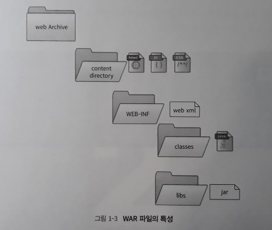
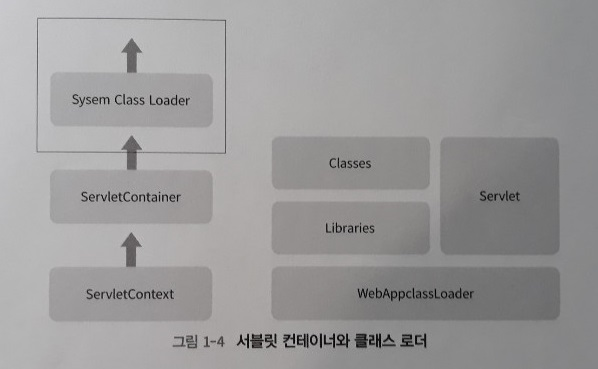

개발 환경의 변화와 자바
=====
## 목차
1. [인프라와 스프링 프레임워크의 변화](#인프라와-스프링-프레임워크의-변화)
	* [아키텍처의 변화](#아키텍처의-변화)
	* [스프링 프레임워크의 변화](#스프링-프레임워크의-변화)
2. [웹 애플리케이션 컨테이너](#웹-애플리케이션-컨테이너)
	* [자바 개발을 위해 꼭 필요한 클래스 로더](#자바-개발을-위해-꼭-필요한-클래스-로더)
		* 클래스 로더의 특징
		* 클래스 로더의 유형
3. WAR 파일의 특성

## 인프라와 스프링 프레임워크의 변화

최근의 웹 개발 트렌드는 마치 프라모델 부품을 조립하는 것처럼 적은 인원으로 빠르게 서비스를 완성하기 위해 **오픈 소스(open source)**들을 조합해서 서비스를 출시하는 경우가 일반화되고 있다.

한편 사람이 땅을 딛지 않고 설 수 없듯 오픈 소스 활성화를 위해서는 개인의 하드웨어부터 인프라 전반에 변화가 필요하다. 이번 장에서는 인프라 및 자바 기술의 변화에 대해 다룬다.

##### [목차로 이동](#목차)

### 아키텍처의 변화
초기에는 일반 사용자를 위한 B2C(Business-to-Customer) 사업 모델이 많지 않았으나 웹이 활성화되고 닷컴 열풍이 불자 각종 커뮤니티 및 온라인 쇼핑몰 등 B2C로의 변화가 인프라의 아키텍처를 바꾸었다.

* Mainframe
* Server / Client
	* Scale-up
* Web
	* Scale-out
	* 벤더
* Cloud
	* Automatic
	* 오픈소스
	
밑으로 갈수록 점점 더 많은 사용자를 대상으로 하는 시스템이다. 각 단계별 구체적 특징은 다음과 같다.

* Mainframe  
* Server / Client
	* 사용자를 위한 GUI(Graphical User Interface) 개발 본격화
	* 웹에서도 애플리케이션을 실행하는 방식(ActiveX)
* Web
	* 직접 통신
		* 서버에서 파일로 데이터를 저장
		* 소켓 통신을 통해 클라이언트와 통신하는 방식
	* 시스템을 3티어(tier)로 구성하는 방식 일반화(∵ 전자상거래/웹 활성화 및 상용 관계형 데이터베이스의 흥행)
		* 데이터는 데이터베이스에 저장
		* JSP, PHP, ASP 같은 서버 언어들로 데이터를 클라이언트에 전달
* Cloud
	* 사용자 수의 변동폭이 매우 큰 서비스(ex. 게임, SNS) 개발에 유리
	* 클라우드 업체의 기술에 종속되는 문제는 단점

게임이나 장비 제어와 같은 특수 분야를 제외하고 회사에서 하는 개발은 크게 두 가지로 구분할 수 있다. 첫째는 엔터프라이즈, 둘째는 웹 서비스다. 엔터프라이즈란 말 그대로 금융 업무, 날씨 같은 분야다. 이들은 보안과 안정성에 민감하고 반드시 트랜잭션이 보장되어야 하므로 메인프레임(Mainframe)을 선호하는 경우가 많다. 한편 통신사의 경우 데이터를 주고 받은 후 특정 장비나 단말기에 표출하는 경우가 많으므로 별도의 UI(User Interface)가 필요 없고, 서버/클라이언트 방식으로 소켓을 통해 데이터를 주고 받기도 한다.
	
##### [목차로 이동](#목차)

### 스프링 프레임워크의 변화
인프라의 변화에 맞물려 스프링 프레임워크도 많은 변화가 있었다. 추후 추가.

##### [목차로 이동](#목차)

## 웹 애플리케이션 컨테이너
웹 애플리케이션 컨테이너(Web Applicaion Container) 또는 웹 애플리케이션 서버(Web Applicaion Server)란, 웹 애플리케이션이 배포되는 공간을 뜻한다. 일반적으로 줄여서 WAS로 부르는데, WAS가 어떻게 웹 애플리케이션을 인식하고 동작시키는지 알기 위해서는 클래스 로더를 알아야 한다.

한편 웹 서버와 웹 애플리케이션 서버의 차이는 다음과 같다.

* 웹 서버: HTML과 같은 정적 파일들을 전달해주는 역할을 하는 서버
* 웹 애플리케이션 서버: PHP, JSP, ASP와 같은 언어들을 사용해서 동적인 페이지들을 생성 가능한 서버

##### [목차로 이동](#목차)

### 자바 개발을 위해 꼭 필요한 클래스 로더
> "한번 작성하면 플랫폼에 상관없이 쓸 수 있다(Write once, run anywhere)"

자바의 특징으로 잘 알려진 이 특징을 가능하게 한 기술이 바로 **클래스 로더(class loader)**다. 클래스 로더란 컴파일된 코드를 JVM이 실행할 수 있도록 로딩해주는 역할을 한다.

종종 다른 사람의 프로젝트를 임포트해서 로컬에서 실행할 때 ClassNotFoundException과 같은 에러를 만나는데 이는 클래스 로더가 추가된 라이브러리 혹은 클래스를 인식하지 못해서 발생하는 오류다. 클래스패스(classpath)에 해당 모듈 또는 라이브러리를 추가하면 오류는 사라진다. 클래스패스에 추가되면 클래스 로더는 식별자로 클래스파일 메타 정보 중 첫 번째 시작 필드를 이용해 클래스를 로딩한다(`자세히..`).

##### [목차로 이동](#목차)

#### 클래스 로더의 특징
클래스 로더는 네 가지 특징이 있다.

* 구조가 계층적  
	 
	* 상위 클래스 로더에서 하위 클래스 로더를 갖는 방식(`자세히..`)
	* 최상위 클래스 로더는 부트스트랩 로더
* 클래스 로딩 위임 가능
* 가시적 규약 존재
	* 가시적 규약이란 클래스 로딩시 가능한 범위 의미
	* 자식 클래스 로더는 클래스 로딩 요청 위임을 통해 부모 클래스 로더가 로딩한 클래스 조회 가능  
	  (부모 클래스 로더는 자식 클래스 로더가 로딩한 클래스 알 수 없음)
* 클래스 언로딩 불가
	* 클래스 로더가 로딩한 클래스들 언로딩 불가(∴ 가비지 컬렉터가 동작하거나 WAS 재시작시 초기화)

##### [목차로 이동](#목차)

#### 클래스 로더의 유형
클래스 로더에는 네 가지 유형이 있다.

* 부트스트랩 로더(bootstrap class loader)
	* JVM 런타임 실행을 위한 기반 파일들 로드(rt.jar)
* 확장 클래스 로더(extension class loader)
	* 자바의 최상위 객체인 Object 포함 자바 API 로드(자바 홈 폴더 하위의 ext 폴더 하위의 JAR 파일들)
* 시스템 클래스 로더(system class loader)
	* 클래스패스에 포함된 클래스들 로드
* 사용자 정의 클래스 로더(user-defined class loader)
	* 시스템 클래스 로더가 로드하는 클래스 패스 영역에만 접근 가능(`자세히..`)  
	  (∴ 로컬에서 외부 라이브러리 실행시 클래스패스 지정해서 실행)
	* WAS의 경우 시스템 클래스 로더 하위에 사용자 정의 로더 만들어 사용  
	  (대부분 개발 환경 설정 문서에서 톰캣 설치 위치를 CATALINA_HOME으로 지정하는 것은 WAS에서 생성한 클래스 로더를 기준으로 동작하기 위함)

##### [목차로 이동](#목차)

## WAR 파일의 특성
배포할 때 로컬 실행 프로그램은 JAR로 패키징하고 웹은 WAR로 패키징한다. WAR는 압축 파일에 자바 관련 규약(WEB-INF 폴더)이 포함된 것이다. 웹 애플리케이션 컨테이너는 WAR 파일의 WEB-INF 폴더를 기준으로 클래스 파일들을 로드한다.

 

* WAR
	* Web Application Archive의 약자이며(`?`), Web Application Resource를 의미
* content directory
	* webapp 또는 web과 같은 이름으로 프로젝트 설정에 따라서 다르지만 브라우저에서 보여줘야 하는 정적 자원 관리 위한 폴더  
	  (ex. HTML, JavaScript, CSS 또는 HTML 태그를 포함하고 있는 JSP 파일 등)
	* 최근에는 WAR 파일의 상위에 두지 않고 WEB-INF 하위에 설정하는 추세
* classes
	* WAR 패키징시 클래스 파일들 저장
* libs
	* JAR 형식의 외부 라이브러리들 위치
	* 이 폴더에 있는 JAR 라이브러리들은 클래스 패스에 추가(∵ 사용자 정의 클래스 로더, 웹 애플리케이션 컨테이너의 로더 통해)

 

p9.

##### [목차로 이동](#목차)
