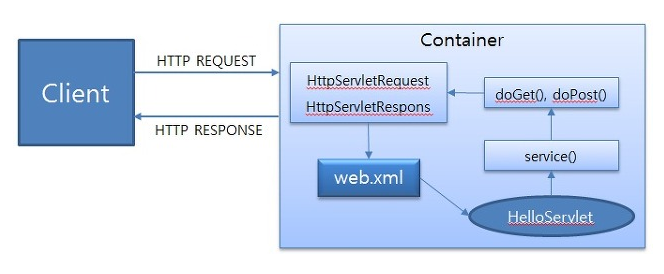
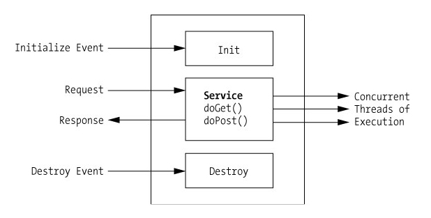
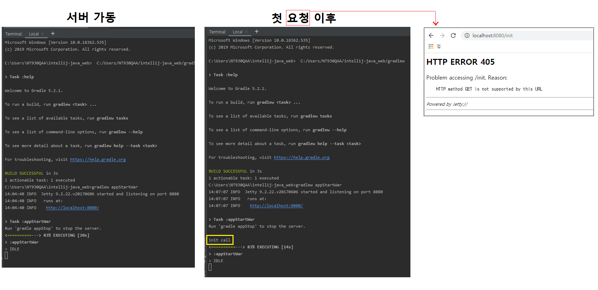
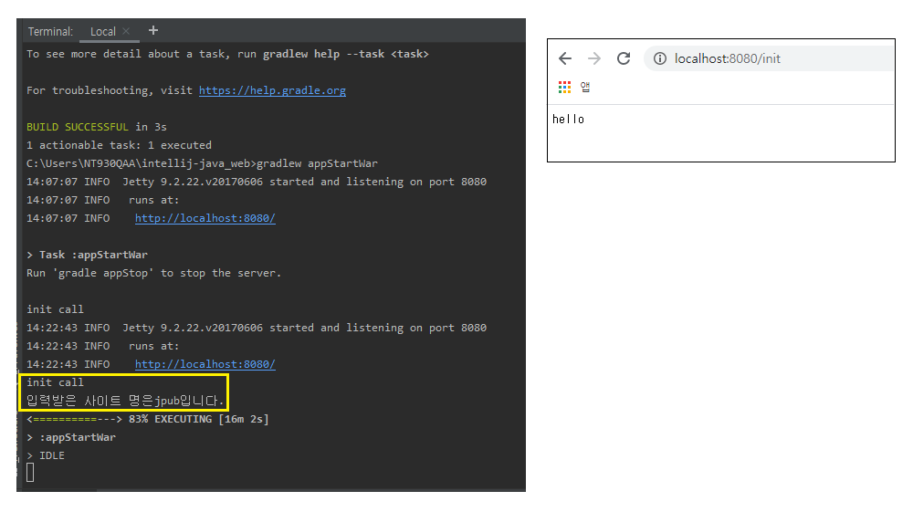
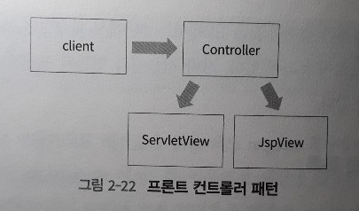
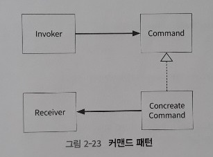

서블릿
=====
## 목차
1. [서블릿 시작하기](#서블릿-시작하기)
	* [서블릿 설정](#서블릿-설정)
2. [서블릿 내부 동작](#서블릿-내부-동작)
	* [서블릿의 생명주기](#서블릿의-생명주기)
	* [서블릿 초기화](#서블릿-초기화)
3. [서블릿 활용](#서블릿-활용)
	* HTTP 요청과 응답
	* 멀티파트
4. 서블릿 관련 객체들
	* 필터
	* 쿠키
	* 세션
5. [디자인 패턴 활용](#디자인-패턴-활용)
	* [Java EE 패턴](#Java-EE-패턴)
	* [프론트 컨트롤러 패턴](#프론트-컨트롤러-패턴)
	* [커맨드 패턴](#커맨드-패턴)
6. [참고](#참고)

## 서블릿 시작하기
서블릿은 JVM 기반에서 웹 개발을 하기 위한 명세이자 API다. 다시 말해 자바를 실행하려면 JRE(Java Runtime Environment)가 필요한 것처럼 서블릿을 실행하려면 웹 애플리케이션 컨테이너가 필요하다(`IoC..?`). 서블릿은 Java EE(Enterprise Edition)에 포함된 스펙 중 하나로 자바에서 HTTP 요청과 응답을 처리하기 위한 내용을 담고 있다. 아래와 같이 정리할 수 있다.

* Servlet이란
	* 웹에서 JAVA 프로그래밍을 구현하기 위해 탄생
	* HTTP Protocol 서비스를 지원하는 `javax.servlet.http.HttpServlet` 클래스 상속
	* Servlet Container에 의해 실행 및 관리
	* HTML 변경시 Servlet 재컴파일 단점
* Servlet Container란
	* HTTP 요청을 받아서 Servlet 실행 및 그 결과를 사용자에게 전달해주는 기능을 제공하는 컴포넌트
		* Servlet 실행 및 생명주기 관리
		* Servlet과 웹 서버(Apache, nginx 등) 통신 방법 제공
	* 클라이언트 다중 요청 처리(∵ 멀티스레딩 지원)
	* 대표적으로 Tomcat, jetty, jboss 등이 있음

- - -
위에서 서블릿이 스펙 혹은 명세라는 말이 나온다. 흔히 인터페이스와 구현체라는 말에서 인터페이스처럼 일종의 프로토콜로 이해했다. 특히 이 경우 스펙을 구현하지 않으면 서블릿으로 동작할 수 없으니 서블릿이 아니다(`자세히..IoC..?`).

##### [목차로 이동](#목차)

### 서블릿 설정


##### [목차로 이동](#목차)

## 서블릿 내부 동작
서블릿 컨테이너는 Servlet의 생성부터 소멸까지의 일련의 과정(Life Cycle)을 관리한다. 우리가 알고 있는 대표적인 Servlet Container는 톰캣이다.

</br>

서블릿 컨테이너(WAS)는 요청이 들어올 때마다 새로운 자바 스레드를 만든다. 자바 파일을 컴파일해서 클래스 파일을 만들고 메모리에 올려 Servlet 객체를 만든다. 서블릿 컨테이너의 동작 과정을 정리하면 다음과 같다.

1. 사용자가 URL을 클릭하면 HTTP Request를 Servlet Container에 보냄
2. Servlet Container는 HttpServletRequest, HttpServletResponse 객체 생성
3. 사용자가 요청한 URL을 분석하여 어느 서블릿에 대한 요청인지 찾음
4. service() 메서드 호출, POST/GET 여부에 따라 doGet() 또는 doPost() 호출
5. doGet() 또는 doPost() 메서드는 동적 페이지 생성 후 HttpServletResponse 객체에 응답 보냄
6. 응답 완료 후 HttpServletRequest, HttpServletResponse 객체 소멸

서블릿 컨테이너는 개발자가 웹서버와 통신하기 위하여 특정 포트에 리스닝하고, 스트림을 생성하는 등 복잡한 일을 생략하게 해준다.

##### [목차로 이동](#목차)

## 서블릿의 생명주기
서블릿은 자신만의 생명주기(life cycle)을 가지고 있고, **웹 애플리케이션 컨테이너에서 콘텍스트가 초기화되면 생명주기가 시작**된다. 서블릿의 생명주기는 초기화(initialize), 서비스(service), 소멸(destroy)의 3단계로 구성되어 있다.

</br>

* 초기화
	* 로드한 서블릿의 인스턴스 생성 및 리소스 로드  
	  (클래스 생성자의 초기화 작업과 동일한 역할 수행)
* 서비스
	* 클라이언트의 요청에 따라 호출할 메서드 결정
* 소멸
	* 서블릿 언로드
	* 언로드는 런타임 오류 및 서블릿 컨테이너가 종료되었을 때 발생

한편, [스프링 컨테이너의 동작 원리](https://github.com/nara1030/spring-basic/blob/master/book/java_web_by_springboot_sjyoon/ch_3.md#%EC%8A%A4%ED%94%84%EB%A7%81-MVC-%EA%B5%AC%EC%A1%B0)는 다음과 같다.

##### [목차로 이동](#목차)

### 서블릿 초기화
초기화 단계와 연관이 있는 `init()` 메서드에 관해 코드를 통해 확인해본다.

```java
package info.thecodinglive.basic;

import javax.servlet.ServletException;
import javax.servlet.annotation.WebServlet;
import javax.servlet.http.HttpServlet;

@WebServlet("/init")
public class InitServlet extends HttpServlet {
    @Override
    public void init() throws ServletException {
        // super.init();
        System.out.println("init call");
    }
}
```

실행 결과는 아래와 같다.

</br>

페이지를 여러 번 호출해도 콘솔에 `init call`이 한 번만 표시된다. init 메서드의 이런 성격을 이용해 초기화 시 파라미터를 전달하고 싶은 경우 servletConfig를 사용한다.

```java
package info.thecodinglive.basic;

import javax.servlet.ServletConfig;
import javax.servlet.ServletException;
import javax.servlet.annotation.WebInitParam;
import javax.servlet.annotation.WebServlet;
import javax.servlet.http.HttpServlet;
import javax.servlet.http.HttpServletRequest;
import javax.servlet.http.HttpServletResponse;
import java.io.IOException;

@WebServlet(name = "initServlet", urlPatterns = {"/init"},
        initParams = {@WebInitParam(name = "siteName", value = "jpub")}
        )
public class InitServlet extends HttpServlet {
    private String myParam = "";

    @Override
    public void init() throws ServletException {
        // super.init();
        System.out.println("init call");
    }
    @Override
    public void init(ServletConfig servletConfig) throws ServletException {
        // super.init(config);
        System.out.println("init call");
        this.myParam = servletConfig.getInitParameter("siteName");
        System.out.println("입력받은 사이트 명은" + myParam + "입니다.");
    }

    @Override
    protected void doGet(HttpServletRequest req, HttpServletResponse resp) throws ServletException, IOException {
        // super.doGet(req, resp);
        resp.getWriter().println("hello");
    }
}

```

아래 실행 결과에서 알 수 있듯 `servletConfig.getInitParameter`를 이용해서 web.xml 또는 WebInitParam 어노테이션의 정보를 서블릿 초기화 시 전달한다.

</br>

##### [목차로 이동](#목차)

## 서블릿 활용


##### [목차로 이동](#목차)

## 디자인 패턴 활용
### Java EE 패턴
Java EE 패턴은 자바 기반의 엔터프라이즈 웹 애플리케이션 개발을 위한 패턴이다. GoF의 디자인 패턴이 애플리케이션 개발 시에 공통적으로 겪게 되는 문제에 대한 해결책을 제시한다면 Java EE 패턴은 자바 웹 개발 시에 겪는 문제를 해결한다.

Java EE는 SUN사가 EJB를 출시하면서 N-Tier 각 레이어에 대한 클래스들의 역할에 관해서 로드맵을 만들고 백서로 배포해서 널리 알려지게 된 패턴이다. GoF가 패턴을 생성, 구조, 행위의 관점에서 구분한 것처럼 Java EE에서는 N-Tier 아키텍처에서 각 레이어에 적합한 패턴으로 구분되어 있다. 자바 서블릿과 연관된 프레젠테이션 레이어에 속하는 Java EE 패턴으 다음과 같다.

1. Intercepting Filter: 요청에 대한 전처리 및 후처리
	* 유동적인 아키텍처를 가능케 함
2. Front Controller: 요청에 대한 처리를 관리하는 중앙 컨트롤러
	* 프레젠테이션 레이어에서 일어나는 일들의 창구
	* facade 패턴의 역할과 MVC 패턴에서 controller의 역할을 함
	* 보안, 뷰 관리, 탐색들을 관리
3. View Helper: 뷰의 표현을 위해 비즈니스 로직을 가지고 있는 개념상의 Helper
	* 비즈니스 로직과 프레젠테이션 로직의 결합도를 낮추기 위해 사용
4. Composite View: 레고 블럭 같은 작은 뷰들을 조합해서 만드는 전체의 뷰
	* 복잡한 뷰 생성 위해 기본적인 뷰 레이어를 융통성 있게 함
	* 개인화 영역 및 커스터마이징 수월하게 함
5. Service to worker: Front Controller와 View Helper Pattern을 이용해 dispatcher 컴포넌트를 구성
6. Dispatcher View

Intercepting Filter는 명칭에서 알 수 있듯 앞서 학습했던 필터가 바로 Intercepting Filter pattern에 대한 구현체다.

##### [목차로 이동](#목차)

### 프론트 컨트롤러 패턴
Front Controller 패턴은 컨트롤러가 공통 요청을 먼저 수행하고 뷰를 호출하는 패턴으로, 대부분의 웹 프레임워크에서 그 개념을 차용하고 있다.

</br>

위 그림에서 보는 바와 같이, 요청에 대해 컨트롤러가 응답하고 결과에 따라 서블릿이나 JSP로 만든 뷰를 보여주게 된다. 예를 들어 게시판의 리스트 화면, 쓰기 화면 요청에 대해서 화면에 바로 전달하지 않고 컨트롤러를 통해 전달하는 것이다. 한편 서버 측에서 메서드를 사용하여 화면을 전환하는 방법에는 두 가지가 있다.

* Response 객체의 sendRedirect 메서드  
	```java
	// HttpServletResponse에 속한 메서드
	response.sendRedirect(경로);
	```
	* 응답을 서버에서 클라이언트로 던지므로 속성 저장 및 다른 로직 추가 불가
* RequestDispatcher 객체의 forward 메서드  
	```java
	// 메서드 사용 위해 requestDispatcher 객체 생성 필요
	RequestDispatcher rd = request.getRequestDispatcher(경로);
	rd.forward(ServletRequest request, ServletResponse response);
	
	if(url == "list") {
		RequestDispatcher rd = req.getRequestDispatcher(url);
		rd.forward(request, response);
	} else if(url == "write") {
		RequestDispatcher rd = req.getRequestDispatcher(url);
		rd.forward(request, response);	
	}
	```
	* requestDispatcher 객체의 경로는 절대경로로 지정(상대경로 사용 불가)
	* forward 메서드 사용 시 servletcontext와 session에 속성 저장 후 포워딩한 곳에서 사용 가능  
	  (∵ sendRedirect와는 다르게 ServletRequest와 ServletResponse 객체를 파라미터로 전달)
	* 컨트롤러에서 화면을 보여주는 구문을 if문으로 분기처리할 경우 유지보수가 어려워지므로(∵ OCP 위반) [커맨드 패턴](#커맨드-패턴) 이용

##### [목차로 이동](#목차)

### 커맨드 패턴
</br>

커맨드 패턴은 명령(로직)을 객체 안에 캡슐화해서 저장함으로써 컨트롤러와 같은 클래스를 수정하지 않고 재사용할 수 있게 하는 패턴이다. Invoker 역할은 컨트롤러가 담당한다. 이전에 있던 forward 메서드 관련 코드를 커맨드로 옮기면 다음과 같다.

```java
.
```


##### [목차로 이동](#목차)

## 참고
* [Servlet의 이해 및 간단 예제 - 구루비](http://wiki.gurubee.net/pages/viewpage.action?pageId=26740202)
* [서블릿 기초 - 장인개발자를 꿈꾸는 :: 기록하는 공간](https://devbox.tistory.com/entry/Servlet-%EC%84%9C%EB%B8%94%EB%A6%BF-%ED%95%84%ED%84%B0%EC%99%80-%EC%9D%B4%EB%B2%A4%ED%8A%B8)
* [서블릿 컨테이너와 스프링 컨테이너 by Wan Blog](https://minwan1.github.io/2017/10/08/2017-10-08-Spring-Container,Servlet-Container/)
* [JSP Tutorial - javatpoint](https://www.javatpoint.com/jsp-tutorial)

##### [목차로 이동](#목차)
