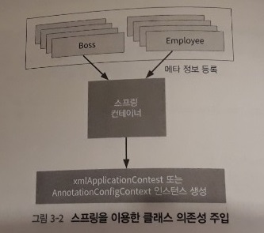

스프링 프레임워크
=====
예제 코드
* 직접
	* [ch03](https://github.com/nara1030/spring-basic/tree/master/book/java_web_by_springboot_sjyoon/src/ch03)
	* ch03-web
* 교재
	* [ch03](https://github.com/thecodinglive/JPub-JavaWebService/tree/master/ch03)
	* [ch03-web](https://github.com/thecodinglive/JPub-JavaWebService/tree/master/ch03-web)
- - -
## 목차
1. [빈과 컨테이너](#빈과-컨테이너)
2. [IoC 패턴 활용](#IoC-패턴-활용)
	* [인터페이스와 스프링](#인터페이스와-스프링)
	* [스프링 XML 설정](#스프링-XML-설정)
		* [스프링 라이브러리 추가](#스프링-라이브러리-추가)
		* [XML 설정 시 빈 생명주기 제어](#XML-설정-시-빈-생명주기-제어)
	* [스프링 JavaConfig 설정](#스프링-JavaConfig-설정)
		* [어노테이션 설정 시 빈 생명주기 제어](#어노테이션-설정-시-빈-생명주기-제어)
3. [스프링 MVC](#스프링-MVC)
	* [스프링 MVC 구조](#스프링-MVC-구조)
	* 스프링 MVC 설정
	* DispatcherServlet 설정
	* 컨트롤러와 뷰
	* 인터셉터
4. [참고](#참고)
	* [Gradle 설정 방법](#Gradle-설정-방법)

## 빈과 컨테이너
**스프링**은 엔터프라이즈 애플리케이션을 개발하기에 적합한 객체 관리를 해주는 빈 컨테이너 프레임워크다. 스프링을 더 잘 이해하기 위해서는 프레임워크의 역사에 관해 간략히 두 단계로 살펴볼 필요가 있다. 먼저 그 시작은 EJB였다.

> Simply put, an **Enterprise Java Bean** is a Java class with one or more annotations from the EJB spec which grant the class special powers when running inside of an EJB container.

위는 EJB, 즉 Enterprise Java Bean의 정의를 발췌한 것이다. 이는 IBM이 1997년 출시한 스펙으로 기업을 위한 최초의 Java 프레임워크다. 하지만 개발에 대한 요구사항이 점점 복잡해지자 사람들은 좀 더 경량화되고 간소화된 컨테이너를 선호하게 되었다. 이때 등장한 것이 POJO다.

> POJO means **Plain Old Java Object**. It refers to a Java object(instance of definition) that isn't bogged down by framework extensions.

추측컨데 프레임워크에 의해 확장, 즉 스펙을 구현하지 않은 평범한 자바 오브젝트가 POJO다. 결과적으로 EJB와 상충되는 방법으로 개발을 진행하고 의견을 모으기 위해서 새로운 용어가 필요했고, 일반 자바 빈이라는 말 대신 POJO를 사용하기 시작했다. 이후 로드 존슨은 `<J2EE 설계와 개발>`이라는 책을 시작으로 웹 애플리케이션 컨테이너와 상관없이 독립적으로 빈의 생명주기를 관리할 수 있는 스프링 프레임워크를 만들게 되고, 큰 인기를 끌게 된다.

현재 스프링은 DataAccess/Web/Core 모듈 외에도 SNS 연동에 유용한 Spring Social, 메시징과 관련된 Spring AMQP, Hbase와 같은 빅데이터 처리를 위한 Spring XD 등 그 영역을 넓혀나가고 있다([공식 사이트](https://spring.io/projects) 통해 확인 가능). 이렇게 모듈을 지속적으로 확장해나갈 수 있는 것은 Spring Core Container를 통해 모듈 간의 의존도를 최소화했기 때문이다. 이렇게 의존도를 낮추는 방법 중 하나는 IoC 패턴을 활용하는 것이다.

##### [목차로 이동](#목차)

## IoC 패턴 활용
이 부분은 책이 명확하게 와닿지 않았다(~~IoC와 같은 의미로 디자인 패턴의 원칙 중에는 DIP가 있다~~). 책에서는 DI와 IoC의 개념을 크게 구분하지 않고 설명하는 듯 싶어서 다른 곳을 참고해 작성한다. 웹 애플리케이션 컨테이너(WAS)의 특성을 설명하기 위해 다음 두 가지 용어를 살펴보면 좋다.

* DI(Dependency Injection)
* IoC(Inversion of Control)

먼저, DI는 우리나라 말로 **의존성 주입**이다. 의존성이란 한 마디로 new다([의존성이란](https://github.com/nara1030/spring-basic/blob/master/book/oop_for_spring_jmkim/ch_7.md#%EC%9D%98%EC%A1%B4%EC%84%B1%EC%9D%B4%EB%9E%80)). 객체간의 이러한 의존성을 직접 해결할 수도 있지만 의존성 주입이라는 말에는 외부에서의 주입이라는 것이 내포되어 있다. 즉 웹 애플리케이션 컨테이너로부터 의존성을 주입받게 된다. 추가로 DI는 왜 필요한가에 대해 생각해볼 수 있다. 답은 코드의 모듈화와 테스트 가능성을 향상시켜주기 때문이다(∵ 행태와 의존성 해결 분리). 이는 DI가 객체지향 언어에서 제공되는 인터페이스(interface)를 활용하여 구현되기 때문에 가능하다(∵ 동료가 인터페이스의 구현체를 완성할 때까지 기다릴 필요 없음). 추가로 책의 내용을 발췌해본다(POJO와도 일맥상통하는 내용인듯). 

> 자바에서는 인터페이스를 사용하더라도 결국 인스턴스화하기 위해서는 반드시 객체 생성에 필요한 코드가 수반되므로 결합도를 완전히 분리해낼 수 없다. 결국 프로그램이 온전히 동작하기 위해서는 인스턴스화할 수 있는 코드에 대한 의존성을 갖게 된다. 그리고 이를 대신 해결해주는 것이 바로 의존성 주입이다.

한편 IoC는 우리나라 말로 **제어의 역전**이다. 이것이 자바 웹 개발에서 특히 알려진 이유는 프로그램의 생명주기에 대한 주도권이 웹 애플리케이션 컨테이너에 있기 때문이다. 흔히 IoC 개념은 프레임워크와 라이브러리 사용 차이에서 확인 가능한데, 라이브러리를 사용하면 필요한 구성요소를 직접 가져와 쓰면 된다. 반면 프레임워크는 규칙에 따라 구성요소를 등록하면, 프레임워크에서 이 구성요소를 가져다 쓰게 된다. 이 관계를 아까 말했듯 제어가 역전되었다고 표현한다. 같은 맥락에서 팩토리 메소드와 템플릿 메소드 패턴 역시 IoC의 예가 된다.

정리하면 의존성 주입(DI)과 제어 역전(IoC)은 모듈간 의존성을 줄이고 소스 수정 없이 런타임에 더욱 유연한 소프트웨어를 만들 수 있는 개발 패턴이다. 이 두 개념을 책은 이렇게 비유적으로 설명한다.

> 클래스나 인터페이스를 사용하기 위해서 해야 하는 행위들, 예를 들어서 고속도로 톨게이트를 통과할 때는 차를 멈추고 손을 뻗어서 통행권을 뽑고 가야 한다. 자동차로 고속도로를 주행할 수 있지만 고속도로를 주행하기 위해서 통행권을 뽑는 행위에 대한 의존성을 가지고 있는 것이다. 그런데 하이패스 단말기를 부착한 차량들은 의존성(통행권을 뽑고 요금을 내는 것)을 하이패스 단말기가 대신 주입해 주므로 의존성에 필요한 행위들을 하지 않고 통과할 수 있다. 이렇게 생각하면 왜 객체 생성 주입, 인터페이스 주입 등의 표현을 쓰지 않고 의존성 주입(DI)이란 용어로 고착화되었는지 이해하기 쉬울 것이다.

- - -
다음 링크([DI는 IoC를 사용하지 않아도 된다 by 정진욱님](https://jwchung.github.io/DI%EB%8A%94-IoC%EB%A5%BC-%EC%82%AC%EC%9A%A9%ED%95%98%EC%A7%80-%EC%95%8A%EC%95%84%EB%8F%84-%EB%90%9C%EB%8B%A4))를 살펴보면 더 자세히 알 수 있다. 아래 일부를 발췌한다.

> DI와 DIP가 별개이듯, IoC도 그렇다. DI를 사용한다고 IoC 컨테이너가 무조건 필요한 것이 아니다. 얼마든지 피자가게 생성자 인수에 피자 인스턴스를 넘겨줄 수 있다. 이것이 DI 개념에 반하는 것이 아니다.

##### [목차로 이동](#목차)

### 인터페이스와 스프링
스프링에서 의존성을 주입할 때는 기본적으로 타입(type)을 기반으로 한다. 그리고 자바에서 타입을 가장 잘 나타낼 수 있는 것은 인터페이스(interface)다. 따라서 인터페이스를 이용한 예제를 만들고 이에 스프링 의존성 주입을 적용해본다(예제 소스 확인).

##### [목차로 이동](#목차)

### 스프링 XML 설정
스프링 컨테이너에 클래스를 등록하면 스프링이 클래스의 인스턴스를 관리해준다. 스프링 컨테이너에 빈(bean)을 등록하고 설정하는 방법은 두 가지가 있다.

* XML
* 어노테이션

먼저 XML로 설정하는 방법을 알아본다.

</br>

위 그림을 통해 알 수 있듯, 설정 파일에 스프링이 정의한 방식대로 클래스 정보를 입력하면 **개발자가 new 연산자를 사용해서 클래스의 인스턴스를 생성하지 않아도** 스프링이 관리해준다. 즉 컨테이너가 직접 의존성을 주입(DI)해준다는 것인데 그말인즉슨 ~~생명주기까지 언급하지 않더라도~~ 제어의 역전(IoC)을 전제하고 있다.

##### [목차로 이동](#목차)

#### 스프링 라이브러리 추가
스프링을 이용해서 클래스(`?`)의 의존성을 주입하려면 스프링 라이브러리를 클래스패스(classpath)에 추가해줘야 한다. 이 책에서 사용하는 빌드 툴인 Gradle에서는 다음과 같이 라이브러리를 추가할 수 있다.

```txt
"org.springframework:spring-core:4.1.6.RELEASE"
"org.springframework:spring-context:4.1.6.RELEASE"
```

* Spring-Core
	* 이름이 암시하는 바와 같이 많은 스프링 모듈이 공통으로 사용하는 라이브러리  
	  (예. Spring-MVC, Spring-JDBC, Spring-Context)
* Spring-Context
	* 접미사가 Context로 되어 있는 요소들은 `spring-context` 라이브러리 안에 포함  
	  (예. XmlApplicationContext, AnnotationConfigContext)
	* `spring-core`에 대한 의존성 가짐(∵ `spring-core`에 기반한 모듈)

한편 **의존성 전의**(Transitive Dependencies)란 B라이브러리가 A라이브러리에 의존성이 있을 때 B를 추가하면 A도 함께 추가되는 것을 말한다(예. `spring-context`). 즉 임의의 라이브러리가 다른 라이브러리에 대한 의존성을 가지고 있는 경우 의존성 전이가 일어나서 필요한 라이브러리가 자동적으로 클래스패스에 추가된다. 하지만 명시적으로 필요한 라이브러리를 추가하는 것을 권장한다.

##### [목차로 이동](#목차)

#### XML 설정 시 빈 생명주기 제어
스프링 라이브러리를 추가한 후 스프링을 통해서 클래스들의 인스턴스를 관리할 수 있도록 아래와 같이 applicationContext.xml 파일을 작성한다.

```xml
// 경로: ch03/src/main/resources/applicationContext.xml
<?xml version="1.0" encoding="UTF-8"?>
<beans xmlns="http://www.springframework.org/schema/beans"
       xmlns:xsi="http://www.w3.org/2001/XMLSchema-instance"
       xsi:schemaLocation="http://www.springframework.org/schema/beans
	   		http://www.springframework.org/schema/beans/spring-beans.xsd">

// 직접 예제 코드 확인
// WorkService처럼 다른 클래스 또는 인터페이스를 멤버 변수로 가지고 있는 경우에는
// property 태그를 사용해서 명시할 수 있고, WorkManager처럼 구현 타입이
// 구체화되지 않은 인터페이스인 경우 ref 태그 사용 구현체 클래스 명시 가능

</beans>
```

이는 bean 태그는 제외한 applicationContext 파일 자체를 위한 내용이다. 각 라인에 대한 설명은 다음과 같다([타교재 설명](https://github.com/nara1030/spring-basic/blob/master/book/oop_for_spring_jmkim/ch_7.md#XML)).

* 1라인: XML 선언
* 2라인: 태그들을 사용하기 위한 xsd 파일 선언  
  (bean 태그 사용 위해서는 spring-beans.xsd 파일 필요)

bean 태그는 beans 태그 사이에 작성하게 되는데, bean 태그로 클래스를 명시하면 직접 new 연산자를 이용해서 인스턴스를 생성했던 작업을 스프링에 위임할 수 있다. `빈 + 컨테이너`라는 말처럼 XML 설정을 통해 실제로 빈을 등록하고 관리할 수 있게 되는 것이다. 즉 bean 태그를 이용하면 소스 코드 상에서는 인스턴스 생성에 대한 부분은 신경쓰지 않고 개발할 수 있다. 이제 XML로 정의한 스프링 설정을 클래스에서 이용하려면 GenericXmlApplicationContext를 사용하면 된다.

```java
// main 메서드 내부
GenericXmlApplicationContext context = new GenericXmlApplicationContext("classpath:applicationContext.xml");

WorkService yourWorkService = context.getBean("yourWorkService", WorkService.class);
yourWorkService.askWork();

context.close();
```

* GenericXmlApplicationContext의 생성자 파라미터로 applicationContext.xml 파일 전달
	* Resources 폴더 내부 파일은 classpath:로 표기
* GenericXmlApplicationContext로 인스턴스 생성 후 getBean 메서드 사용
	* XML에 설정한 id 값과 클래스명 사용
* close 메서드는 main 메서드로 실행 시에 프로그램 종료 역할

이제 main 메서드 안에서 new를 하는 코드는 없다. 만약 앞으로 인스턴스를 생성해야 하는 클래스가 추가된다면 코드상에서 추가하는 것이 아니라 스프링에서 bean으로 등록 후에 참조하도록 하면 된다. 한편 스프링이 인스턴스 관리를 해주기 때문에 편리하지만 그만큼 생성 여부와 소멸 여부를 파악하기가 어려워진다. 그래서 스프링에서는 객체를 빈으로 등록하거나 제거할 때 콜백 메서드(`?`)를 등록할 수 있는 방법을 제공한다.

* init-method
	* 구현체 클래스  
		```java
		public void onCreated() {
			System.out.println("Boss 생성");
		}
		```
	* applicationContext.xml  
		```xml
		<bean id="boss" class="basic.Boss" init-method="onCreated"></bean>
		```
* destroy-method
	* 구현체 클래스  
		```java
		public void onDestroyed() {
			System.out.println("Boss 소멸");
		}
		```
	* applicationContext.xml  
		```xml
		<bean id="boss" class="basic.Boss" destroy-method="onDestroyed"></bean>
		```

자세한 코드는 예제 코드를 참고한다.

##### [목차로 이동](#목차)

### 스프링 JavaConfig 설정
자바 5 이상부터는 XML을 사용하지 않고 자바 코드만으로 스프링 컨테이너 설정을 할 수 있다.

* @Configuration  
	```java
	// 패키지 및 임포트 정보 생략
	@Configuration
	public class BeanConfig {
		// 기존 bean id 태그로 등록한 부분은 @Bean과 메서드명으로 대체
		@Bean
		public WorkManager employee() {
			return new Employee();
		}
		
		@Bean
		public WorkManager boss() {
			return new Boss();
		}
		
		@Bean
		public WorkService yourWorkService() {
			WorkService workService = new WorkService();
			workService.setWorkManager(employee());
			return workService;
		}
		
		@Bean
		public WorkService myWorkService() {
			WorkService workService = new WorkService();
			workService.setWorkManager(boss());
			return workService;
		}
	}
	```
	* applicationContext.xml과 같은 XML 파일을 사용하지 않고 자바 클래스에서 설정할 때는 Configuration 어노테이션을 클래스 상단에 추가해서 이 클래스가 빈 설정 정보가 포함된 클래스임을 명시
	* 기존 XML에서 사용했던 `<bean>` 태그들은 @Bean 어노테이션으로 대체
* @Import
	* .

##### [목차로 이동](#목차)

#### 어노테이션 설정 시 빈 생명주기 제어
어노테이션 설정을 했을 때도 XML 설정과 같이 초기화와 종료 시에 callback 메서드를 추가할 수 있다.

##### [목차로 이동](#목차)

## 스프링 MVC
**스프링 MVC**는 [2장](ch_2.md)에서 살펴보았듯이 Front Controller 패턴에 Spring 의존성 주입(DI)을 이용해서 컴포넌트들의 생명주기를 관리할 수 있는 컨트롤러 중심의 웹 MVC 프레임워크다.

##### [목차로 이동](#목차)

## 스프링 MVC 구조
</br>

##### [목차로 이동](#목차)

## 참고
* EJB vs. POJO
	* [A Detailed Guide to Enterprise Java Beans w/Code Examples](https://stackify.com/enterprise-java-beans/)
	* [POJO의 이해 - Hong's Store House](http://asuraiv.blogspot.com/2017/07/spring-pojo.html)
	* [POJO vs Java Beans - GeeksforGeeks](https://www.geeksforgeeks.org/pojo-vs-java-beans/)
* DI
	* [DI가 필요한 이유와 스프링에서 속성 주입보다 생성자 주입이 권장되는 이유 - Mimul님](https://www.mimul.com/blog/di-constructor-injection/)
	* [의존성 주입과 제어 역전 - 정광섭님](https://www.lesstif.com/pages/viewpage.action?pageId=24445829)
	* [의존성 주입을 왜 하나요? - KIN님](https://kin33.tistory.com/26)
* 스프링 프레임워크
	* [Spring IoC Container Overview - Java Guides](https://www.javaguides.net/2018/10/spring-ioc-container-overview.html)
	* [IoC 컨테이너와 DI - DOGvelopers님](https://dog-developers.tistory.com/12)

##### [목차로 이동](#목차)

### Gradle 설정 방법
추후 정리.

* [Could not find method leftShift..](https://stackoverflow.com/questions/55793095/could-not-find-method-leftshift-for-arguments-after-updating-studio-3-4)

##### [목차로 이동](#목차)
