2장. 자바와 절차적/구조적 프로그래밍
=====
## 목차
1. [자바의 개발과 구동](#자바의-개발과-구동)
	* [T 메모리 구조](#T-메모리-구조)
	* [절차 및 구조적 프로그래밍 유산](#절차-및-구조적-프로그래밍-유산)
2. [객체 제외 메모리 사용 예제](#객체-제외-메모리-사용-예제)
	* [메서드 스택 프레임1](#메서드-스택-프레임1)
		* [JVM 전처리 작업](#메인-메서드가-실행되기-전-JVM에서-수행하는-전처리-작업들)
	* [변수와 메모리](#변수와-메모리)
	* [블록 구문과 메모리](#블록-구문과-메모리)
		* [지역 변수와 메모리](#지역-변수와-메모리)
	* [메서드 스택 프레임2](#메서드-스택-프레임2)
		* Call by value
	* 전역 변수와 메모리
3. 기타
	* 멀티 스레드/멀티 프로세스의 이해

## 자바의 개발과 구동
자바 프로그램을 개발할 때, 구동할 때 각각 어떤 개발 도구가 필요한지 정리하면 아래와 같다.

| 현실 세계 | 자바 세계 | |
| :- | :-- | :-- |
| 소프트웨어 개발 도구 | JDK - 자바 개발 도구 | JVM용 소프트웨어 개발 도구 |
| 운영체제 | JRE - 자바 실행 환경 | JVM용 OS |
| 하드웨어 - 물리적 컴퓨터 | JVM - 자바 가상 기계 | 가상의 컴퓨터 |

JDK는 자바 소스 컴파일러인 `javac.exe`를 포함하고 있고, JRE는 자바 프로그램 실행기인 `java.exe`를 포함하고 있다. JRE는 프로그램 안에 `main()` 메소드가 있는지 확인한다. `main()` 메소드의 존재가 확인되면 JRE는 프로그램 실행을 위한 사전 준비에 착수한다. 가상의 기계인 JVM에 전원을 넣어 부팅하는 것이다. 부팅된 JVM은 목적 파일을 받아 그 목적 파일을 실행한다. 이를 위해 JVM이 가장 먼저 하는 일을 전처리라고 한다.

##### [목차로 이동](#목차)

### T 메모리 구조

프로그램이 메모리를 사용하는 방식에 대해 도식화하면 아래와 같다.

* 프로그램이 메모리를 사용하는 방식  
	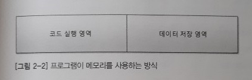</br>
* 객체 지향 프로그램의 메모리를 사용하는 방식  
	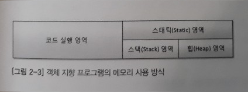</br>
	* 객체 지향 프로그램에서는 데이터 저장 영역을 세 개의 영역으로 분할 사용

변수의 종류에 따라 메모리(데이터 저장 영역)에 저장되는 위치가 다르다.

* 스택 영역
	* **지역 변수**는 스택 영역(스택 프레임 내부)에서 일생을 보냄
	* 스택 프레임이 사라지면 함께 소멸
* 스태틱 영역
	* **클래스 멤버 변수**는 스태틱 영역에서 일생을 보냄
	* JVM이 종료될 때까지 유지
* 힙 영역
	* **객체 멤버 변수**는 힙에서 일생을 보냄(`??`)
	* 객체와 함께 가비지 컬렉터라고 하는 힙 회수기에 의해 소멸
	
단, 이 단원에서 메모리의 힙 영역에 대해서는 언급하지 않는다. 힙 영역은 OOP에서 클래스와 객체 언급 이후에 다루기 때문이다.
	
##### [목차로 이동](#목차)

### 절차 및 구조적 프로그래밍 유산
`객체 지향` 프로그래밍은 `절차적/구조적` 프로그래밍의 어깨를 딛고 있다. 따라서 절차적/구조적 프로그래밍이란 무엇인지 아는 것이 중요하다.

* 절차적 프로그래밍
	* `goto` 사용 금지
* 구조적 프로그래밍
	* 함수 사용 강제
		1. 중복 코드 제거
		2. 논리를 함수 단위로 분리
		3. `전역 변수`보다는 `지역 변수` 사용 권장

그렇다면 자바 언어에서 이러한 절차적/구조적 프로그래밍의 유산은 어디에 남아 있을까? 정답은 `메서드`다. 객체 지향에서 제어문이 존재할 수 있는 유일한 공간이 바로 메서드 내부이기 때문이다.
		
관련해서 자세한 내용에 관해서는 다음 [링크](https://github.com/nara1030/ThisIsJava/blob/master/docs/etc/programming_paradigm.md).

##### [목차로 이동](#목차)

## 객체 제외 메모리 사용 예제
프로그램이 실행될 때 메모리, 즉 T 메모리에 어떤 일이 일어나는지 생각해볼 필요가 있다.

### 메서드 스택 프레임1
가장 기본이자 필수적이라고 할 수 있는 `main()` 메소드에 대해 살펴본다.

```java
public class Start {
	public static void main(String[] args) {
		System.out.println("Hello OOP!!");
	}
}
```

위에서 JRE가 프로그램 내부에 `main()` 메소드의 존재를 확인하면 JVM을 부팅하고, JVM은 [전처리](#메인-메서드가-실행되기-전-JVM에서-수행하는-전처리-작업들)를 수행한다고 했다. 모든 전처리 과정이 완료된 T 메모리의 모습은 아래와 같다.

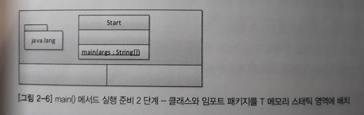</br>

이후 `main()` 메서드가 놀기 위해 스택 프레임(stack frame)이 스택 영역에 할당된다. 더 정확히 말하면 **여는 중괄호를 만날 때마다 스택 프레임이 하나씩** 생긴다.

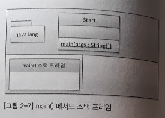</br>

이후 메서드의 인자 args를 저장할 변수 공간을 스택 프레임의 맨 밑에 확보해야 한다. 즉, 메서드 인자(들)의 변수 공간을 할당하는 것이다.

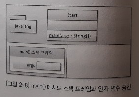</br>

이후 `main()` 메서드 안의 첫 명령문을 실행하게 된다.

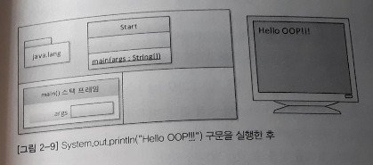</br>

그리고 `main()` 메서드의 끝을 나타내는 닫는 중괄호와 만났을 때 스택 프레임이 소멸된다. 여기서는 T 메모리 소멸, JVM 기동 중지, JRE가 사용했던 시스템 자원을 운영체제에 반납하게 된다.

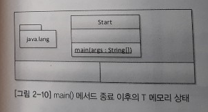</br>

##### [목차로 이동](#목차)

### 메인 메서드가 실행되기 전 JVM에서 수행하는 전처리 작업들
* `java.lang` 패키지를 T 메모리의 스태틱 영역에 배치
* import된 패키지를 T 메모리의 스태틱 영역에 배치
* 프로그램 상의 모든 클래스를 T 메모리의 스태틱 영역에 배치
	
##### [목차로 이동](#목차)

### 변수와 메모리
[T 메모리 구조](#T-메모리-구조)에서 언급을 했지만, 다음 예를 통해 변수와 그것이 저장되는 위치에 대해 살펴본다.

```java
public class Start2 {
	public static void main(String[] args) {
		int i;
		i = 10;
		
		double d = 20.0;
	}
}
```

2번째 줄까진 첫 번째 예제와 동일하므로 3번째 줄이 실행되었을 때의 T 메모리 구조를 살펴보면 아래와 같다.

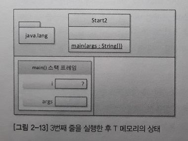</br>

`main()` 메서드 내에 있으니까 당연히 `main()` 메서드 스택 프레임 안에 밑에서부터 차곡차곡 변수 공간을 마련한다. 현재는 변수 i를 선언만 하고 초기화하지 않은 상태이므로 지금 변수를 사용하는 코드를 만나면 자바 컴파일러(javac)는 `"The local variable i may not have been initialized"` 경고를 토해낸다. 이후 6번째 줄을 실행한 후 T 메모리의 상태는 다음과 같다.

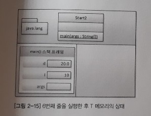</br>

7번째 줄의 닫는 중괄호로 `main()` 메서드 스택 프레임이 스택 영역에서 사라진다.

##### [목차로 이동](#목차)

### 블록 구문과 메모리
위에서 `"여는 중괄호를 만날 때마다 스택 프레임이 하나씩 생긴다"`고 언급했다. 관련 예제는 아래와 같다.

```java
public class Start3 {
	public static void main(String[] args) {
		int i = 10;
		int k = 20;
		// 5번째 줄
		if(i == 10) {
			int m = k + 5;
			k = m;
		} else {
			int p = k + 10;
			k = p;
		}
		
		// k = m + p;
	}
}
```

5번째 줄까지는 이전 예제와 동일하다.

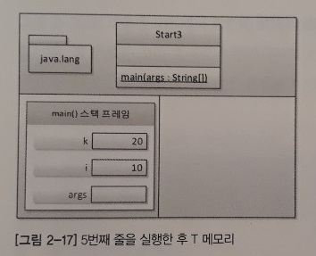</br>

7번째 줄 및 8번째 줄까지 실행한 후 T 메모리는 각각 아래와 같다.

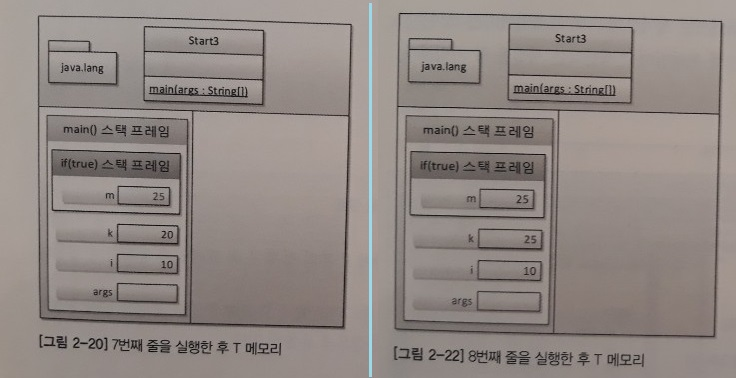</br>

이후 9번째 줄에서 if 블록 중 참일 때의 블록을 종료하는 닫는 중괄호를 만나면 if 블록 스택 프레임은 스택 영역에서 사라진다(if 블록 스택 프레임 안에 상주하던 변수의 저장 공간도 함께 사라진다).  9번째 줄에서 12번째 줄 사이의 else문 블록은 스택 메모리에 등장해볼 기회조차 갖지 못했다.

##### [목차로 이동](#목차)

#### 지역 변수와 메모리
지금까지 프로그램이 돌 때 T 메모리가 어떻게 변화하는지, 좀 더 구체적으로는 T 영역 중 스택 영역의 변화를 살펴보았다. T 메모리 구조를 언급하며 다뤘지만 [스택 영역](#T-메모리-구조)에서 활동하는 변수는 지역 변수다. 이제 이를 `코드 실행 영역`의 관점에서 보면 다음과 같이 정리할 수 있다.

> "외부 스택 프레임에서 내부 스택 프레임의 변수에 접근하는 것은 불가능하나 그 역은 가능하다"

[코드](#블록-구문과-메모리)로 예를 들면 쉽다. 7번째 줄의 코드(`int m = k + 5`)를 보면 if 블록 스택 프레임을 수행하는 중에 if 블록 스택 프레임 외부에 존재하는 변수 k는 접근이 가능하다는 것이다(메모리 상에 변수 k가 존재하니 당연히 접근이 가능하다). 흔히 책에서 `"외부 블록에서 내부 블록의 변수에는 접근할 수 없지만 내부 블록에서 외부 블록의 변수에 접근하는 것은 가능하다"` 같은 말을 본 적이 있을 것이다. 이는 제임스 고슬링이 일부러 그렇게 만든 것이 아니라 시간의 흐름, 즉 코드 진행에 따른 T 메모리의 변화를 보면 당연히 그럴 수밖에 없다. 그래서 스택 메모리 내 스택 프레임 안의 변수를 지역 변수라고 한다. 그 지역(스택 프레임) 안에서만 사용할 수 있고 외부에서는 사용할 수 없기 때문이다. 또한 그 지역이 사라지면 지역 변수도 메모리에서 함께 사라진다.

##### [목차로 이동](#목차)

### 메서드 스택 프레임2
메인 메서드 이외 다른 메서드, 즉 메서드 호출 과정에서 T 메모리의 변화를 살펴본다.

```java
public class Start4 {
	public static void main(String[] args) {
		int k = 5;
		int m;
		// 5번째 줄
		m = square(k);
	}
	// 8번째 줄
	private static int square(int k) {
		int result;
		k = 25;
		result = k;
		return result;
	}
}
```

5번째 줄이 끝났을 때 메모리 스냅샷은 아래와 같다.

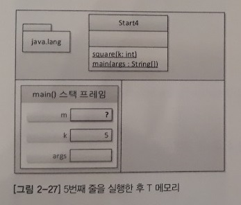</br>

6번째 줄에서 `square()` 메서드를 호출하고 있다(`square()` 메서드는 인자값도 있고 반환값도 있다). 따라서 제어 흐름이 `square()` 메서드가 선언된 9번째 줄로 이동할 것이다. 메서드 호출이 일어나면 무조건 호출되는 메서드의 스택 프레임이 T 메모리 스택 영역에 새로 생성된다.

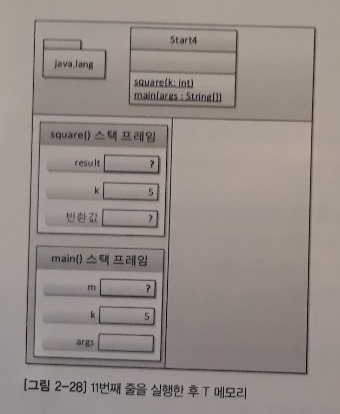</br>

위에서 보이는 바와 같이 `square()` 메서드 스택 프레임에는 반환값을 저장할 변수 공간이 맨 아래, 그 다음으로 인자를 저장할 변수 공간, 그리고 마지막으로 메서드의 지역 변수가 자리 잡는다(`??`).

주목해야 할 것은 `main()` 메서드가 가진 변수 k와 `square()` 메서드가 가진 변수 k가 이름만 같지 실제로는 서로 별도의 변수 공간이라는 것이다. 따라서 `square()` 메서드 안의 k 변수에 무슨 짓을 해도 `main()` 메서드 안의 k 변수는 영향이 없다. 이를 전문 용어로 Call By Value, 즉 값에 의한 호출이라 한다. 그럼 값의 전달은 어떻게 하느냐? 14번째 줄에서 `square()` 메서드의 끝인 닫는 중괄호를 만나면 `square()` 메서드의 스택 프레임은 스택에서 사라진다. 단, 반환값을 돌려주면서 사라진다(`m = square(k)`). 정리하면 A 메서드에서 B 메서드 내의 변수는 접근할 수 없다는 것이다. 이를 도식화하면 아래와 같다.

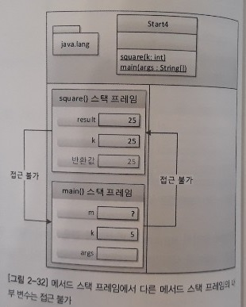</br>

메서드 블랙박스화. 캡슐화. 파라미터 규칙. 예외 처리.

##### [목차로 이동](#목차)
