3장. 자바와 객체 지향
=====
## 목차
1. [개요](#개요)
2. [객체 지향의 4대 특성](#객체-지향의-4대-특성)
	* [추상화](#추상화)
		* [추상화와 T 메모리](#추상화와-T-메모리)
	* [상속](#상속)
		* [상속은 is a 관계를 만족해야 한다](#상속은-is-a-관계를-만족해야-한다)
		* [다중상속과 자바](#다중상속과-자바)
			* [상속과 인터페이스](#상속과-인터페이스)
		* [상속과 T 메모리](#상속과-T-메모리)
	* [다형성](#다형성)
		* [다형성과 T 메모리](#다형성과-T-메모리)
		* [다형성이 지원되지 않는 언어](#다형성이-지원되지-않는-언어)
	* [캡슐화](#캡슐화)
3. [기타](#기타)

## 개요
지금까지 살펴본 프로그래밍 언어의 발전사를 보면 개발자를 더 편하게 하기 위한 과정이었다. 특히 절차적/구조적 프로그래밍까지는 인간이 기계를 이해하려는 노력에서 크게 벗어나지 못했으나 객체 지향은 `"우리가 눈으로 보고, 느끼고, 생활하는 현실 세계처럼 프로그래밍할 수는 없을까"` 하는 고민 속에서 탄생했다.

* 구조적 프로그래밍
	* 복잡한 문제를 작은 문제로 분할해서 해결(D&C: Divide and Conquer)
	* 즉 몇 천, 몇 만 단위의 명령어를 논리적 단위(함수)로 블록화해서 작성
* 객체 지향 프로그래밍
	* 0과 1로 대변되는 기계에 맞춰 사고하던 방식을 버리고 현실세계를 인지하는 방식으로 프로그램 작성(직관적)
	* 객체 지향 이전에는 속성(필드) 따로, 메서드(함수) 따로 분리된 형태로 프로그램을 작성했었는데, 객체 지향에서는 우리가 주변에서 실제 사물을 인지 및 사고하는 방식대로 **객체 단위**의 프로그래밍이 가능

간단하게 표로 정리하면 아래와 같다.

| 종류 | 핵심 개념 |
| :--: | :--: |
| 구조적 | 함수 |
| 객체지향 | 객체 |
	
##### [목차로 이동](#목차)

## 객체 지향의 4대 특성
앞으로 언급할 객체지향의 4대 특성은 그 앞글자를 따서 아래와 같이 정리할 수 있다.

* 캡 - 캡슐화(Encapsulation): 정보 은닉(Information hiding)
* 상 - 상속(~~Inheritance~~): 재사용
* 추 - 추상화(Abstraction): 모델링
* 다 - 다형성(Polymorphism): 사용 편의

`Inheritance`에는 취소선이 그어져 있는데 그 이유는 뒤에서 설명한다.

- - -
객체 지향 관련해서 잘못된 설명 하나를 짚고 넘어간다. 바로 클래스와 객체의 관계는 `붕어빵틀과 붕어빵이다`라고 하는 설명이다. 그 근거는 아래와 같다.

```java
클래스 객체명 = new 클래스();
붕어빵틀 붕어빵 = new 붕어빵틀();	// ??
```

즉, `클래스 : 객체 = 붕어빵틀 : 붕어빵`, 이와 같은 관계가 성립되지 않는다는 것이다. 클래스는 **분류에 대한 개념**이지 실체가 아니기 때문이다. 즉, 올바른 메타포는 `클래스 : 객체 = 사람 : 김연아`와 같은 것이다.

한편 붕어빵틀은 이 책의 6장(스프링이 사랑한 디자인 패턴)에서 언급할 팩토리라고 할 수 있다.

##### [목차로 이동](#목차)

### 추상화
추상화의 IT적인 정의는 다음과 같다.

> 추상화란 구체적인 것을 분해해서 관심 영역(애플리케이션 경계, Application Boundary)에 있는 특성만 가지고 재조합하는 것

즉, 추상화는 모델링이다. 모델은 실제 사물을 정확히 복제하는 것이 아니라 목적에 맞게 관심 있는 특성만을 추출해서 표현하는 것이다. 이런 모델링(추상화)은 **객체 지향에서 클래스를 설계할 때** 필요한 기법(즉, 추상화의 결과물이 모델이고 자바에선 이것이 클래스로 표현)이고 또한 데이터베이스의 테이블을 설계할 때 필요한 기법이다. 이 기법의 이해를 위해서는 두 가지 개념을 잡고 넘어가야 한다.

* 객체와 클래스
	* 세상에 존재하는 유일무이한 객체를 특성(속성 + 기능)에 따라 분류해보니 객체를 통칭할 수 있는 집합적 개념, 즉 클래스(분류)가 나오게 됨
* 컨텍스트(Context)
	* `애플리케이션 경계`의 또 다른 표현
	* 내가 만들고자 하는 애플리케이션은 어디에서 사용될 것인가?
		* 애플리케이션의 용도에 따라서 클래스의 설계, 즉 모델링(추상화) 역시 달라져야 함

</br>

아래 중요한 부분을 다시 한 번 요약한다.

> * OOP의 추상화는 모델링이다.
> * 클래스 : 객체 = 사람 : 김연아
> * 클래스 설계에서 추상화가 사용된다.
> * 클래스 설계를 위해서는 애플리케이션 경계부터 정해야 한다.
> * 객체 지향에서 추상화의 결과는 클래스다.

- - -
추후 살펴보겠지만 추상화의 개념을 넓게 본다면 아래 내용도 포함된다.

* 상속을 통한 추상화, 구체화
* 인터페이스를 통한 추상화
* 다형성을 통한 추상화

한편, 

* 자바는 class 키워드를 통해 객체 지향의 추상화를 지원
	* 추상화 = 모델링 = 자바의 class 키워드
* 자바에서 클래스와 객체의 관계를 표현하는 법
	* ```java
	  클래스 객체_참조_변수 = new 클래스();
	  // 객체_참조_변수의_자료형(Type) 생성된_객체를_참조할_수_있는_변수
	  // 할당문 새로운 만들고자_하는_객체의_분류 메서드
	  ```
	* 새로운 객체를 하나 생성해 그 객체의 주소값(포인터)를 객체 참조 변수에 할당

##### [목차로 이동](#목차)

#### 추상화와 T 메모리
메모리 구조를 살피기 전에 클래스 설계, 즉 모델링(추상화)의 정의를 한 번 더 상기한다. 예를 들어 애니메이션의 쥐 캐릭터 관리 프로그램을 만든다고 가정한다.

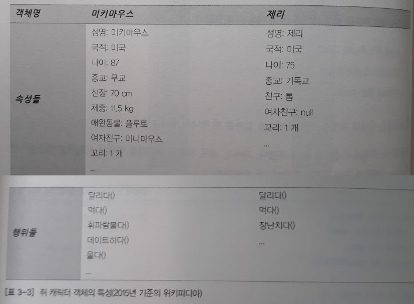</br>

추상화란 애플리케이션 경계 내에서 관심 있는 특성들만 추출하는 과정이다. 추상화의 결과물은 모델인데, 이는 자바 언어에서 클래스로 표현된다. 클래스 모델을 표현하는 국제 표준 표기법은 UML 클래스 다이어그램이다(클래스 다이어그램을 상세하게 표현해도 메소드 내부 로직은 표현하지 못한다).

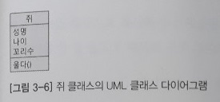</br>

이를 코드로 표현하기 위해서는 논리적 설계를 물리적 설계로 바꿔야 한다. 논리적 설계는 개발 환경(언어 등)에 영향을 받지 않는 설계이며, 물리적 설계는 개발 환경에 맞춰진 설계이다.

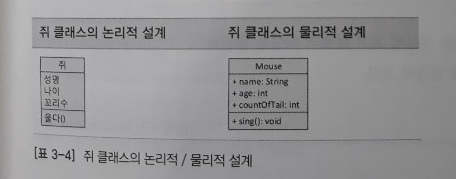</br>

이를 자바 코드로 표현하면 아래와 같다.

```java
public class Mouse {
	public String name;
	public int age;
	public int countOfTail;
	
	public void sing() {
		System.out.println(name + "찍찍!!!");
	}
}

public class MouseDriver {
	public static void main(String[] args) {
		Mouse mickey = new Mouse();
		mickey.name = "미키";
		mickey.age = 85;
		mickey.countOfTail = 1;
		
		mickey.sing();
		
		mickey = null;
		// 14번째 줄
		Mouse jerry = new Mouse();
		jerry.name = "제리";
		jerry.age = 73;
		jerry.countOfTail = 11;
		
		jerry.sing();
	}
}
```

`main()` 메서드 실행 직전, 15번째 줄을 실행한 후의 T 메모리는 각각 아래와 같다.

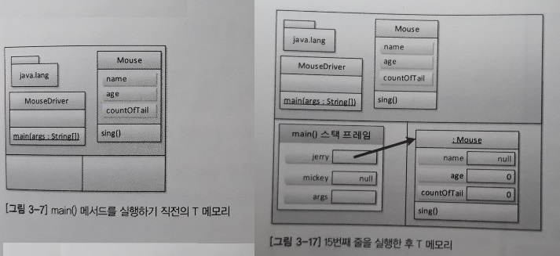</br>

이때 jerry 변수가 참조하고 있는 Mouse 객체는 mickey가 참조하고 있던 Mouse 객체가 아니다. 한편 위처럼 추상화를 했을 경우 생각해볼만한 지점이 있는데, 아래를 살펴보자.

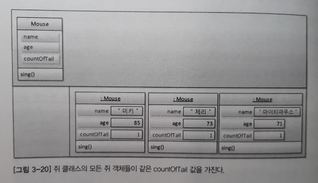</br>

즉, T 메모리를 보면 모든 Mouse 객체가 같은 값을 갖는 꼬리 개수(countOfTail) 속성이 있음에도 Mouse 객체 수만큼 아까운 메모리를 잡아먹고 있다. 이런 경우 아래와 같이 한 곳에서만 쥐의 꼬리 개수(countOfTail)를 저장하려면 어떻게 해야 할까?

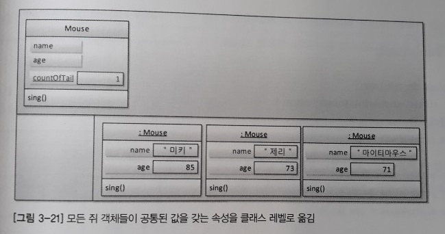</br>

**static** 키워드 속성 앞에 붙이면 된다. 그렇게 되면 countOfTail 속성은 T 메모리의 스태틱 영역에 단 하나의 저장 공간을 갖게 된다.

```java
public class Mouse {
	public String name;
	public int age;
	public static int countOfTail = 1;
	
	public void sing() {
		System.out.println(name + "찍찍!!!");
	}
}
```

정리하면 객체(ex. 미키마우스, 제리)가 아닌 클래스(ex. 쥐)임에도 꼬리 개수에 답이 있는, 즉 객체의 속성이지만 모든 객체가 같은 값을 갖고 있는 경우가 있다. 이런 경우 static 키워드를 이용해 스태틱 영역에 값을 저장할 수 있다.

컴파일 타임. 런타임. 추후 추가.

##### [목차로 이동](#목차)

### 상속
객체 지향의 상속은 영어 단어를 그대로 옮기면서 생긴 오해라고 할 수 있다. 객체 지향에서의 상속은 상위 클래스의 특성을 하위 클래스에서 상속(특성 상속)하고 거기에 더해 필요한 특성을 추가, 즉 확장해서 사용할 수 있다는 의미다. 즉, 아래와 같이 분류도로 이해하는 것이 맞다.

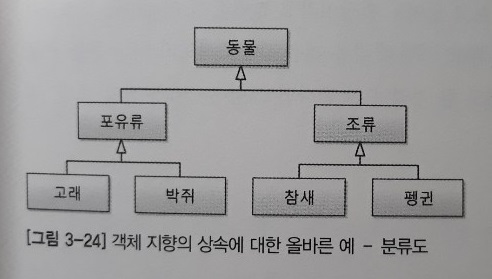</br>

그런데 사람들은 클래스의 특성을 상속한다는 말에서 특성을 빼고 클래스를 상속한다는 뜻으로 오해를 하니 부모-자식 관계가 나와버린 것이다. 또한 상위 클래스 쪽으로 갈수록 추상화, 일반화됐다고 말하며 하위 클래스 쪽으로 갈수록 구체화, 특수화됐다고 말한다. 추상화의 IT 정의가 분류, 즉 집합적 개념이라고 했는데 일맥상통하다고 할 수 있다.

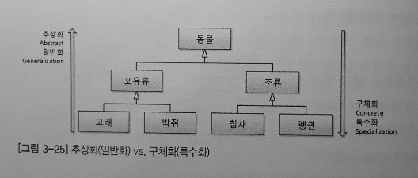</br>

추가로 자바 언어에서 inheritance(상속)라는 키워드는 존재하지 않는다. 대신 extends(확장)가 존재한다. 자바 언어의 아버지, 제임스 고슬링의 의도를 파악할 수 있다.

- - -
한편, 객체 참조 변수명은 객체스럽게, 클래스명은 클래스명답게 정하는 습관을 들이길 강조한다.

```java
조류 bird = new 조류();	// X
조류 aBird = new 조류();	// O
```
##### [목차로 이동](#목차)

#### 상속은 is a 관계를 만족해야 한다
이 말은 상속에 대한 오해를 불러 일으킨다. 어떤 면에서 그런지 살펴보자.

> 하위 클래스 is a 상위 클래스(ex. 펭귄 is a 동물)

이를 번역하면 `"하위 클래스는 하나의 상위 클래스이다"`와 같다. 하지만 **하나의 상위 클래스**는 하나의 객체다. 즉, is a 관계는 객체(클래스의 인스턴스)와 클래스의 관계로 오해될 소지가 많다. 그렇다면 상속 관계의 더 명확한 영어 표현은 무엇일까? 바로 `is a kind of` 관계다.

> 하위 클래스 is a kind of 상위 클래스

* 펭귄 is a kind of 조류 → 펭귄은 조류의 한 분류다.
* 펭귄 is a kind of 동물 → 펭귄은 동물의 한 분류다.

즉, 상속의 핵심에 대해 정리하면 아래와 같다.

* 객체 지향의 상속은 상위 클래스**의 특성을** 재사용하는 것이다.
* 객체 지향의 상속은 상위 클래스의 특성을 확장하는 것이다.
* 객체 지향의 상속은 is a kind of 관계를 만족해야 한다.

- - -
> "하위 클래스는 상위 클래스다"

위 문장은 로버트 C. 마틴이 주장한 객체 지향 설계 5원칙 가운데 LSP(리스코프 치환 원칙)을 나타내는 말이다(`??` → 추후 추가).

* 포유류는 동물이다.
* 고래는 포유류다.
* 고래는 동물이다.

##### [목차로 이동](#목차)

#### 다중상속과 자바


##### [목차로 이동](#목차)

##### 상속과 인터페이스
다중 상속을 포기하고 인터페이스를 도입한 자바에서 인터페이스는 어떤 관계를 나타낼까? 간단하게 정리하면 아래와 같다.

|  | 상속 관계 | 인터페이스 |
| :--: | -- | -- |
|   | 하위 클래스 is a kind of 상위 클래스 | 구현 클래스 is able to 인터페이스 |
| 해석 | 하위 클래스는 상위 클래스의 한 분류다 | 구현 클래스는 인터페이스할 수 있다 |
| 예제 | 고래는 동물의 한 분류다 | 고래는 헤엄칠 수 있다 |

즉 인터페이스는 be able to, 다시 말해 "무엇을 할 수 있는"과 같은 표현 형태로 만드는 것이 좋다. 정리하면 상위 클래스는 하위 클래스에게 특성(속성과 메서드)을 상속해주고, 인터페이스는 클래스가 '무엇을 할 수 있다'라고 하는 기능을 구현하도록 강제하게 한다. 여기서 한 가지 생각해볼 수 있다.

* 상위 클래스는 하위 클래스에게 물려줄 특성이 많을수록 좋을까? 적을수록 좋을까?
* 인터페이스는 구현을 강제할 메서드가 많을수록 좋을까? 적을수록 좋을까?

추후 추가. p119.

- - -
자바 API에서도 이러한 be able to 형식의 인터페이스를 많이 볼 수 있다.

* Serializable 인터페이스: 직렬화할 수 있는
* Cloneable 인터페이스: 복제할 수 있는
* Comparable 인터페이스: 비교할 수 있는
* Runnable 인터페이스: 실행할 수 있는

추후 추가.

##### [목차로 이동](#목차)

#### 상속과 T 메모리
아래와 같은 예제 코드가 있다(없어도 무방하나 책 없을 때를 대비해 작성).

```java
public class Animal {
	public String name;
	
	public void showName() {
		System.out.printf("안녕 나는 %s야. 반가워\n, name);
	}
}

public class Penguin extends Animal {
	public String habitats;
	
	public void showHabitat() {
		System.out.printf("%s는 %s에 살아\n, name, habitat);
	}
}

public class Driver {
	public static void main(String[] args) {
		Penguin pororo = new Penguin();
		// 6번째 줄
		pororo.name = "뽀로로";
		pororo.habitat = "남극";
		
		pororo.showName();
		pororo.showHabitat();
		// 12번째 줄
		Animal pingu = new Penguin();
		// pingu.habitat = "EBS";
		
		pingu.showName();
		// pingu.showHabitat();
		// 18번째 줄
		// Penguin happyfeet = new Animal();
	}
}
```

5번째 줄을 실행한 후의 T 메모리는 아래와 같다.

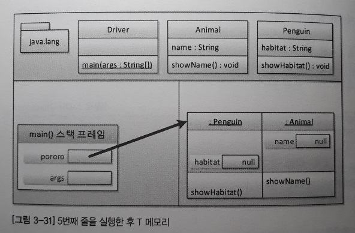</br>

중요한 것은 Penguin 클래스의 인스턴스만 힙 영역에 생긴 게 아니라 Animal 클래스의 인스턴스도 함께 힙 영역에 생긴 것이다. 즉, 하위 클래스의 인스턴스가 생성될 때 상위 클래스의 인스턴스도 함께 생성된다. 그림에서는 생략했지만 사실 Animal 인스턴스 외에도 최상위 클래스인 Object 클래스의 인스턴스도 함께 생성된다. 한편 13번째 줄을 실행한 후 T 메모리의 구조는 다음과 같다.

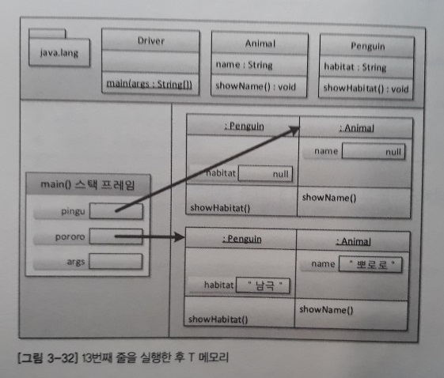</br>

5번째 줄을 실행했을 때와 다른 점은 `pingu` 객체 참조 변수가 가리키고 있는 것은 Penguin 인스턴스가 아닌 Animal 인스턴스라는 점이다. 따라서 `pingu` 변수는 자신이 동물이라는 것만 인식하고 있으므로 14, 17번째 줄을 사용할 수 없다.

* [묵시적/명시적 형변환](https://sangmoo.tistory.com/53). p127.
* [오브젝트 - 다형성](https://github.com/nara1030/portfolio/blob/master/docs/lecture_list/code_spitz/s83_object1/object1_week1_ch00-ch01.md)
* 링크드 리스트 개념? → 추후 추가.

##### [목차로 이동](#목차)

### 다형성
다형성이란 **동일한 조작방법으로 메소드를 동작시키지만 실제 동작은 다른 것**을 의미한다(출처: [생활코딩](https://www.opentutorials.org/module/2495/14143)). 즉 객체 지향에서 다형성이라고 하면 오버라이딩(overriding)과 오버로딩(overloading)이라고 할 수 있다(오버로딩이 다형성인지 아닌지에 대해서는 이견이 있다). 아래 예시 코드를 살펴본 후 메모리 사용을 분석해본다.

```java
public class Animal {
	public String name;
	
	public void showName() {
		System.out.printf("안녕 나는 %s야. 반가워\n", name);
	}
}

public class Penguin extends Animal {
	public String habitat;
	
	public void showHabitat() {
		System.out.printf("%s는 %s에 살아\n", name, habitat);
	}
	
	// 오버라이딩 - 재정의
	// 상위클래스의 메서드와 같은 메서드 이름, 같은 인자 리스트
	public void showName() {
		System.out.println("어머 내 이름은 알아서 뭐하게요?");
	}
	
	// 오버로딩 - 중복정의
	// 같은 메서드 이름, 다른 인자 리스트
	public void showName(String yourName) {
		System.out.printf("%s 안녕, 나는 %s라고 해\n", yourName, name);
	}
}

public class Driver {
	public static void main(String[] args) {
		Penguin pororo = new Penguin();
		// 6번째 줄
		pororo.name = "뽀로로";
		pororo.habitat = "남극";
		// 9번째 줄
		pororo.showName();
		pororo.showName("초보람보");
		pororo.showHabitat();
		// 13번째 줄
		Animal pingu = new Penguin();
		
		pingu.name = "핑구";
		pingu.showName();
	}
}
```

실행 결과는 다음과 같다.

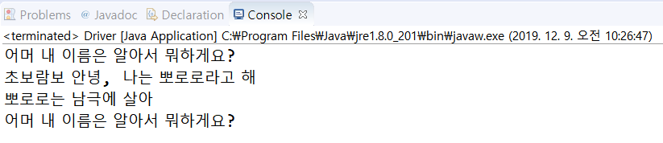</br>

핵심은 4번째 줄, 즉 `pingu.showName()`의 실행 결과다. 이는 **상위 클래스 타입의 객체 참조 변수를 사용하더라도 하위 클래스에서 오버라이딩한 메서드가 호출**된다는 것을 의미한다.

##### [목차로 이동](#목차)

#### 다형성과 T 메모리
5번째 줄 및 14번째 줄을 실행한 뒤의 T 메모리 스냅샷은 각각 아래와 같다.

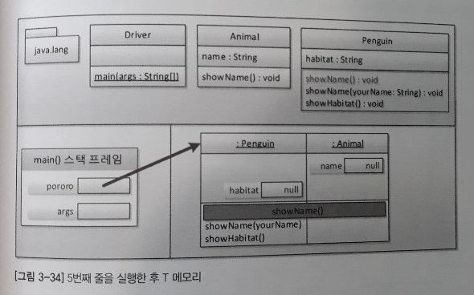</br>

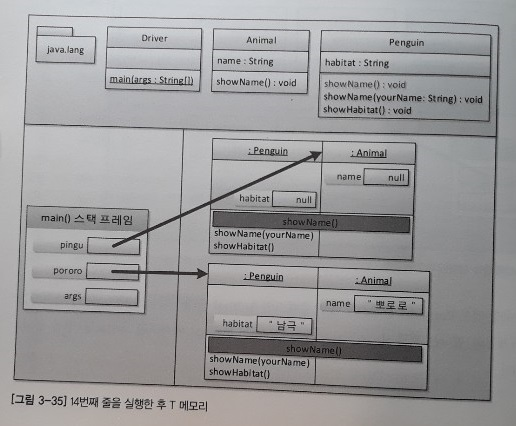</br>

이를 통해 아래 두 코드의 결과가 같은 이유를 알 수 있다.

```java
pororo.showName();	// 10번째 줄
pingu.showName();	// 17번째 줄
```

Animal 객체에 정의된 `showName()` 메서드가 Penguin 객체에 있는 `showName()` 메서드에 의해 재정의, 즉 가려졌기 때문에 Penguin 객체에 있는 `showName()` 메서드가 실행된다.

##### [목차로 이동](#목차)

#### 다형성이 지원되지 않는 언어


##### [목차로 이동](#목차)

### 캡슐화
자바에서 정보 은닉(information hiding)이라고 하면 접근 제어자인 private, [default], protected, public이 떠오를 것이다(~~이 책에서 응집도 개념은 언급하지 않은 듯 싶다~~). 접근 제어자가 객체 멤버(인스턴스 멤버)와 쓰일 때와 정적 멤버(클래스 멤버)와 함께 쓰일 때를 비교해서 살펴보자.

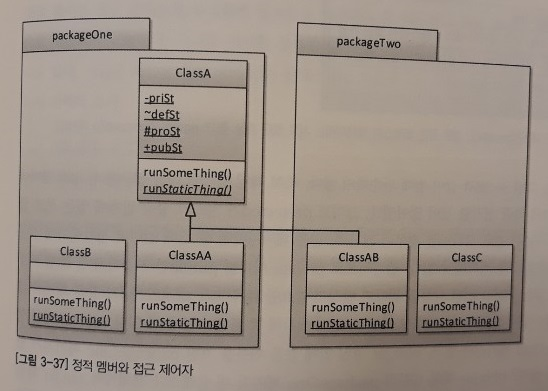</br>

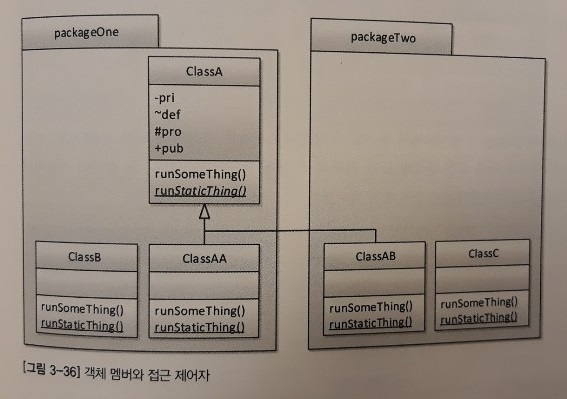</br>

* .
* [정답 예제 코드](https://github.com/expert0226/oopinspring/tree/master/workspace_springjava/Chap03/src/encapsulation01)

##### [목차로 이동](#목차)

## 기타

##### [목차로 이동](#목차)
