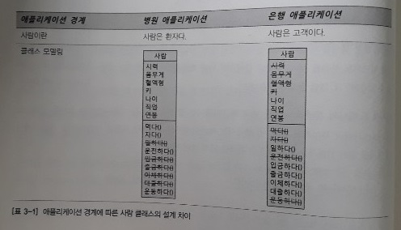

3장. 자바와 객체 지향
=====
## 목차
1. [개요](#개요)
2. [객체 지향의 4대 특성](#객체-지향의-4대-특성)
	* [추상화](#추상화)
		* 추상화와 T 메모리
	* [상속](#상속)
	* [다형성](#다형성)
	* [캡슐화](#캡슐화)
3. [기타](#기타)

## 개요
지금까지 살펴본 프로그래밍 언어의 발전사를 보면 개발자를 더 편하게 하기 위한 과정이었다. 특히 절차적/구조적 프로그래밍까지는 인간이 기계를 이해하려는 노력에서 크게 벗어나지 못했으나 객체 지향은 `"우리가 눈으로 보고, 느끼고, 생활하는 현실 세계처럼 프로그래밍할 수는 없을까"` 하는 고민 속에서 탄생했다.

* 구조적 프로그래밍
	* 복잡한 문제를 작은 문제로 분할해서 해결(D&C: Divide and Conquer)
	* 즉 몇 천, 몇 만 단위의 명령어를 논리적 단위(함수)로 블록화해서 작성
* 객체 지향 프로그래밍
	* 0과 1로 대변되는 기계에 맞춰 사고하던 방식을 버리고 현실세계를 인지하는 방식으로 프로그램 작성(직관적)
	* 객체 지향 이전에는 속성(필드) 따로, 메서드(함수) 따로 분리된 형태로 프로그램을 작성했었는데, 객체 지향에서는 우리가 주변에서 실제 사물을 인지 및 사고하는 방식대로 **객체 단위**의 프로그래밍이 가능

간단하게 표로 정리하면 아래와 같다.

| 종류 | 핵심 개념 |
| :--: | :--: |
| 구조적 | 함수 |
| 객체지향 | 객체 |
	
##### [목차로 이동](#목차)

## 객체 지향의 4대 특성
앞으로 언급할 객체지향의 4대 특성은 그 앞글자를 따서 아래와 같이 정리할 수 있다.

* 캡 - 캡슐화(Encapsulation): 정보 은닉(Information hiding)
* 상 - 상속(~~Inheritance~~): 재사용
* 추 - 추상화(Abstraction): 모델링
* 다 - 다형성(Polymorphism): 사용 편의

`Inheritance`에는 취소선이 그어져 있는데 그 이유는 뒤에서 설명한다.

- - -
객체 지향 관련해서 잘못된 설명 하나를 짚고 넘어간다. 바로 클래스와 객체의 관계는 `붕어빵틀과 붕어빵이다`라고 하는 설명이다. 그 근거는 아래와 같다.

```java
클래스 객체명 = new 클래스();
붕어빵틀 붕어빵 = new 붕어빵틀();	// ??
```

즉, `클래스 : 객체 = 붕어빵틀 : 붕어빵`, 이와 같은 관계가 성립되지 않는다는 것이다. 클래스는 **분류에 대한 개념**이지 실체가 아니기 때문이다. 즉, 올바른 메타포는 `클래스 : 객체 = 사람 : 김연아`와 같은 것이다.

한편 붕어빵틀은 이 책의 6장(스프링이 사랑한 디자인 패턴)에서 언급할 팩토리라고 할 수 있다.

##### [목차로 이동](#목차)

### 추상화
추상화의 IT적인 정의는 다음과 같다.

> 추상화란 구체적인 것을 분해해서 관심 영역(애플리케이션 경계, Application Boundary)에 있는 특성만 가지고 재조합하는 것

즉, 추상화는 모델링이다. 모델은 실제 사물을 정확히 복제하는 것이 아니라 목적에 맞게 관심 있는 특성만을 추출해서 표현하는 것이다. 이런 모델링(추상화)은 **객체 지향에서 클래스를 설계할 때** 필요한 기법이고 또한 데이터베이스의 테이블을 설계할 때 필요한 기법이다. 이 기법의 이해를 위해서는 두 가지 개념을 잡고 넘어가야 한다.

* 객체와 클래스
	* 세상에 존재하는 유일무이한 객체를 특성(속성 + 기능)에 따라 분류해보니 객체를 통칭할 수 있는 집합적 개념, 즉 클래스(분류)가 나오게 됨
* 컨텍스트(Context)
	* `애플리케이션 경계`의 또 다른 표현
	* 내가 만들고자 하는 애플리케이션은 어디에서 사용될 것인가?
		* 애플리케이션의 용도에 따라서 클래스의 설계, 즉 모델링(추상화) 역시 달라져야 함

</br>

아래 중요한 부분을 다시 한 번 요약한다.

> * OOP의 추상화는 모델링이다.
> * 클래스 : 객체 = 사람 : 김연아
> * 클래스 설계에서 추상화가 사용된다.
> * 클래스 설계를 위해서는 애플리케이션 경계부터 정해야 한다.
> * 객체 지향에서 추상화의 결과는 클래스다.

- - -
추후 살펴보겠지만 추상화의 개념을 넓게 본다면 아래 내용도 포함된다.

* 상속을 통한 추상화, 구체화
* 인터페이스를 통한 추상화
* 다형성을 통한 추상화

한편, 

* 자바는 class 키워드를 통해 객체 지향의 추상화를 지원
	* 추상화 = 모델링 = 자바의 class 키워드
* 자바에서 클래스와 객체의 관계를 표현하는 법
	* ```java
	  클래스 객체_참조_변수 = new 클래스();
	  객체_참조_변수의 자료형(Type) ▣ 생성된_객체를_참조할_수_있는_변수 ▣ 할당문 ▣ 새로운 만들고자_하는_객체의_분류 ▣ 메서드
	  ```
	* 새로운 객체를 하나 생성해 그 객체의 주소값(포인터)를 객체 참조 변수에 할당

##### [목차로 이동](#목차)

#### 추상화와 T 메모리


##### [목차로 이동](#목차)

### 상속


##### [목차로 이동](#목차)

### 다형성


##### [목차로 이동](#목차)

### 캡슐화


##### [목차로 이동](#목차)

## 기타


##### [목차로 이동](#목차)
