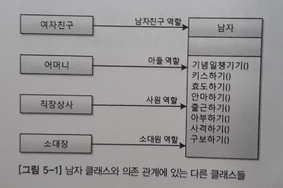
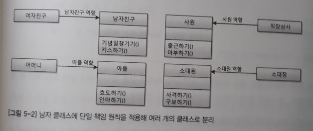
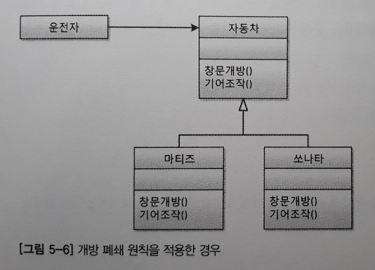
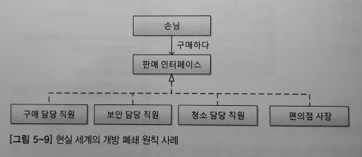
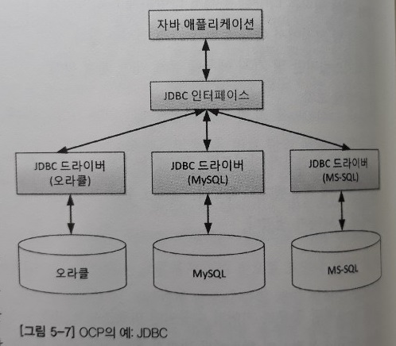
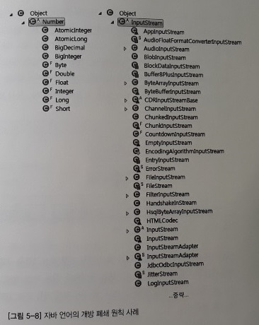
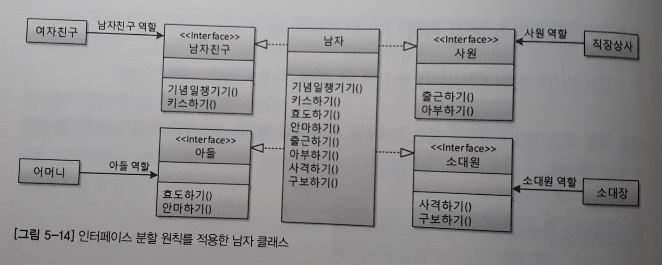
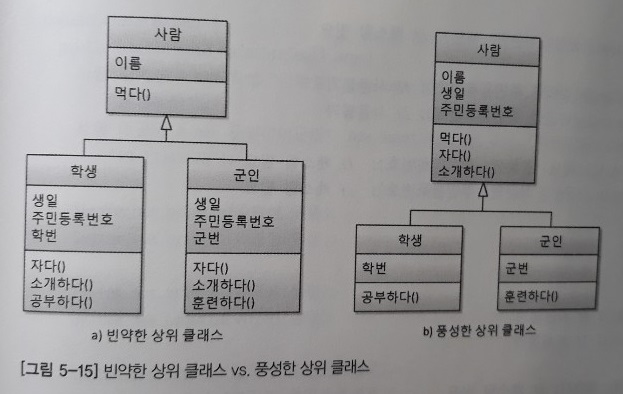
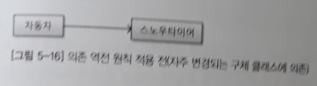
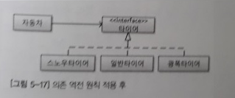

5장. 객체 지향 설계 5원칙 - SOLID
=====
* 주방기구: 객체 지향의 4대 특성
* 주방기구를 올바르게 사용하는 법: 객체 지향 설계의 5원칙
- - -
## 목차
1. [SOLID](#SOLID)
	* [SRP](#SRP)
	* [OCP](#OCP)
	* [LSP](#LSP)
	* [ISP](#ISP)
	* [DIP](#DIP)
2. [기타](#기타)
	* [결합도와 응집도](#결합도와-응집도)
	* [정리](#정리)
	* [참고문헌](#참고문헌)

## SOLID
SOLID는 로버트 C. 마틴이 2000년대 초반 객체 지향 프로그래밍 및 설계의 다섯 가지 기본 원칙으로 제시한 것을 마이클 페더스가 두문자어로 소개한 것으로 아래 5가지 원칙이다.

* SRP(Single Response Principle): 단일 책임 원칙
* OCP(Open Closed Principle): 개방 폐쇄 원칙
* LSP(Liskov Substitution Principle): 리스코프 치환 원칙
* ISP(Interface Segregation Principle): 인터페이스 분리 원칙
* DIP(Dependency Inversion Principle): 의존 역전 원칙

이 원칙들은 응집도는 높이고(High Cohesion), 결합도는 낮추라(Loose Coupling)는 고전 원칙을 객체 지향의 관점에서 재정립한 것이라고 할 수 있다. SOLID는 객체 지향 4대 특성을 발판으로 하고 있으며, 앞으로 언급할 디자인 패턴의 뼈대이며 스프링 프레임워크의 근간이기도 하다. SOLID와 관련한 더 많은 내용은 [다음](#참고문헌)에서 살펴볼 수 있다.

### SRP
> "어떤 클래스를 변경해야 하는 이유는 오직 하나뿐이어야 한다" - 로버트 C. 마틴

쉬운 이해를 돕기 위해 비유적인 예를 하나 들어본다.

</br>

위와 같이 남자 클래스와 그에 의존하는 다양한 클래스를 가정한다. 이와 같이 남자 클래스에 부여된 역할과 책임이 많은 경우 객체 지향에서는 **나쁜 냄새가 난다**고 한다. 예를 들어 어느 날 여자친구와 헤어졌다고 하면 남자는 더 이상 챙길 일 없는 기념일과 대상이 없는 키스하기에 힘들어하게 된다. 거기에 더해 여자 친구 없는 스트레스를 온 세상에 뿌리고 다니니 어머니, 직장 상사, 소대장님까지 피곤한 지경에 이르게 되고야 만다. 따라서 이런 경우에 아래와 같이 역할(책임)을 분리하라는 것이 단일 책임 원칙이다.

</br>

남자라는 하나의 클래스가 **역할과 책임에 따라** 네 개의 클래스로 쪼개진 것을 볼 수 있다. 그리고 역할과 클래스명도 딱 떨어지니 이해하기도 좋다. 이제 여자 친구와 이별하더라도 남자 친구만 상처를 입으면 된다. 여기서는 클래스 분할에 대해서만 이야기했지만 단일 책임 원칙은 속성, 메서드, 패키지, 모듈, 컴포넌트, 프레임워크 등에도 적용할 수 있는 개념이다. 한편 단일 책임 원칙은 잘된 경우보다 잘못된 경우를 살펴보는 것이 이해하기 좋다. 몇 가지 잘못된 사례들을 살펴보자.

* 속성이 SRP를 지키지 않은 경우  
	```java
	class 사람 {
		String 군번;
		// ...
	}
	
	사람 로미오 = new 사람();
	사람 줄리엣 = new 사람();
	줄리엣.군번 = "1573045840";	// 이건?
	```
	* 문제점
		* 사람형 참조 변수 줄리엣이 가진 군번 속성에 값을 할당하거나 읽어오는 코드를 제제할 방법 없음
	* 해결방법
		* 사람 클래스를 남자/여자로 분할하고 남자 클래스에만 군번 속성을 갖도록 리팩토링
		* 두 클래스간 공통점이 많다면 사람 클래스를 상위 클래스로 유지
	* 기타
		* 하나의 속성이 여러 의미를 갖는 경우도 SRP 위반
			* 데이터베이스 테이블에 존재하는 하나의 필드가 토지인 경우 면적을, 건물인 경우 층수를 나타내는 경우  
			  → 자바 코드에서는 if문을 여기저기 사용
* 메서드가 SRP를 지키지 않은 경우  
	```java
	class 강아지 {
		final static Boolean 수컷 = true;
		final static Boolean 암컷 = false;
		Boolean 성별;
		
		void 소변보다() {
			if(this.성별 == 수컷) {
				// 한쪽 다리를 들고 소변을 본다.
			} else {
				// 뒷다리 두 개를 굽혀 앉은 자세로 소변을 본다.
			}
		}
	}
	```
	* 문제점
		* 강아지가 수컷이냐 암컷이냐에 따라 `소변보다()` 메서드에서 분기 처리 진행  
		  (∵ 메서드가 SRP를 지키지 않을 경우 나타나는 대표적인 냄새가 바로 분기 처리를 위한 if문)
		* 강이지 클래스의 `소변보다()` 메서드가 수컷 강아지의 행위와 암컷 강아지의 행위를 모두 구현하려고 하기에 단일 책임(행위) 원칙 위배
	* 해결방법  
		```java
		abstract class 강아지 {
			abstract void 소변보다();
		}
		
		class 수컷강아지 extends 강아지 {
			void 소변보다() {
				// 한쪽 다리를 들고 소변을 본다.
			}
		}
		
		class 암컷강아지 extends 강아지 {
			void 소변보다() {
				// 뒷다리 두 개로 앉은 자세로 소변을 본다.
			}
		}
		```

그렇다면 단일 책임 원칙과 객체 지향 4대 특성은 어떻게 결부되어 있을까? 바로 모델링 과정을 담당하는 추상화와 가장 깊은 연관이 있다고 할 수 있다. 즉, 애플리케이션의 경계를 정하고 추상화를 통해 클래스들을 선별하고 속성과 메서드를 설계할 때 반드시 SRP를 고려하는 습관을 들여야 한다. 뿐만 아니라 리팩토링을 통해 코드를 개선할 때도 SRP를 적용할 수 있는지 꼼꼼히 살펴야 한다.

##### [목차로 이동](#목차)

### OCP
> "소프트웨어 엔티티(클래스, 모듈, 함수 등)는 확장에 대해서는 열려 있어야 하지만 변경에 대해서는 닫혀 있어야 한다" - 로버트 C. 마틴

위 문장을 조금 더 의역하면 아래와 같다.

> "자신의 확장에는 열려 있고, 주변의 변화에 대해서는 닫혀 있어야 한다"

쉬운 예를 몇 가지 들어본다.

</br>

위와 같이 상위 클래스 또는 인터페이스를 중간에 둠으로써 다양한 자동차가 생긴다고 해도 객체 지향 세계의 운전자는 운전 습관에 영향을 받지 않게 된다. 다양한 자동차가 생긴다고 하는 것은 **자동차 입장에서는** 자신의 확장에는 개방돼 있는 것이고, **운전자 입장에서는** 주변의 변화에 폐쇄돼 있는 것이다. 이와 비슷한 현실 세계의 개방 폐쇄 원칙을 하나 더 살펴본다.

</br>

편의점 근무자는 3교대지만 직원이 바뀐다고 해서 손님이 구매라는 행위를 하는 데는 영향이 없다. 즉 손님과의 인터페이스가 바뀌지 않는 한 손님의 구매라는 행위는 직원이 세부적으로 구매 담당자든, 보안 담당자든 전혀 영향을 받지 않는다. 직원 교대라고 하는 주변의 변화에 손님의 구매 행위는 영향을 받지 않는 것이고, 직원은 교대라고 하는 확장 행위에는 열려 있는 것이다. 이외 프로그래밍적으로 찾아볼 수 있는 예는 아래와 같다.

* JDBC를 사용하는 클라이언트는 데이터베이스가 오라클에서 MySQL로 바뀌더라도 Connection 설정 외에는 수정 불필요  
	</br>
* 상속 구조를 통해 자바에 숨겨져 있는 개방 폐쇄 원칙 확인 가능  
	</br>

정리하면, 개방 폐쇄 원칙을 무시하면 객체 지향 프로그래밍의 가장 큰 장점인 유연성, 재사용성, 유지보수성 등을 얻을 수 없다. 이러한 개방 폐쇄 원칙에 대한 좋은 예로 스프링 프레임워크를 들 수 있다.

##### [목차로 이동](#목차)

### LSP
> "서브 타입은 언제나 자신의 기반 타입(base type)으로 교체할 수 있어야 한다" - 로버트 C. 마틴


##### [목차로 이동](#목차)

### ISP
> "클라이언트는 자신이 사용하지 않는 메서드에 의존 관계를 맺으면 안 된다" - 로버트 C. 마틴

단일 책임 원칙 예제를 상기하면 당시 제시한 [해결책](#SRP)은 남자 클래스를 토막내서 하나의 역할(책임)만 하는 다수의 클래스로 분할하는 것이었다. 그런데 꼭 분할하는 방법뿐일까? 이때 선택할 수 있는 방법이 ISP, 즉 인터페이스 분할 원칙이다.

</br>

결론적으로 단일 책임 원칙(SRP)과 인터페이스 분할 원칙(ISP)은 같은 문제에 대한 두 가지 다른 해결책이라고 볼 수 있다. 하지만 특별한 경우가 아니라면 단일 책임 원칙을 적용하는 것이 더 좋은 해결책이라고 할 수 있다. 한편 인터페이스 분할 원칙(ISP)을 이야기할 때 항상 함께 등장하는 원칙 중 하나로 인터페이스 최소주의 원칙이라는 것이 있다. 위 예를 통해 설명하면 남자친구 인터페이스에 `사격하기()` 메서드를 제공할 필요도 없고 제공해서도 안 된다는 것이다. 이는 3장에서 객체 지향 4대 특성 중 [상속](ch_3.md#상속과-인터페이스)에 대해 설명하며 살펴본 바 있는데 아래 예를 통해 더 자세히 살펴본다.

</br>

추후 추가.

##### [목차로 이동](#목차)

### DIP
> A. High-level modules should not depend on low-level modules. Both should depend on abstractions.  
> B. Abstractions should not depend on details. Details should depend on abstractions.

이는 모두 로버트 C. 마틴의 말로 DIP 원칙을 나타내는 말이다(참고로 관련 개념으로 DI, IoC 등은 다음 [링크](https://jwchung.github.io/DI%EB%8A%94-IoC%EB%A5%BC-%EC%82%AC%EC%9A%A9%ED%95%98%EC%A7%80-%EC%95%8A%EC%95%84%EB%8F%84-%EB%90%9C%EB%8B%A4) 참고하면 좋다). 간단한 것으로 책의 예는 아래와 같다.

</br>

흔히 피자 가게와 피자의 예를 들지만 책에선 자동차와 타이어를 예로 들었다. 의존 역전 원칙 적용 전에는 더 중요한 모듈이 덜 중요한 모듈에 의존하고 있다. 즉 자동차는 한 번 사면 몇 년은 타야 하는데 스노우타이어는 계절이 바뀌면 일반 타이어로 교체해야 한다. 하지만 이런 경우 교체 시 자동차는 변경의 영향에 노출되어 있다.

</br>

의존 역전 원칙 적용 후 자동차가 추상화된 타이어 인터페이스에만 의존하게 함으로써 타이어 변경에 영향을 받지 않게 되었다. 이처럼 변하기 쉬운 것에 의존하던 것을 추상화된 인터페이스나 상위 클래스를 두어 변하기 쉬운 것의 영향을 받지 않도록 하는 것이 의존 역전 원칙이다. 이제 다시 로버트 C. 마틴의 문장을 읽어보면 정리가 될 것이다. 한편 이는 개방 폐쇄 원칙(OCP)을 설명할 때도 든 예였는데 이처럼 하나의 해결책 안에 여러 설계 원칙이 녹아 있는 경우가 많다. 그것은 뒤에서 언급할 디자인 패턴에서도 마찬가지다.

##### [목차로 이동](#목차)

## 기타

### 결합도와 응집도
좋은 소프트웨어 설계를 위해서는 결합도(coupling)는 낮추고 응집도(cohesion)는 높이는 것이 바람직하다.

* 결합도
	* 모듈(클래스) 간의 상호 의존 정도
	* **결합도가 낮으면** 모듈 간의 상호 의존성이 줄어들어 객체의 재사용이나 수정, 유지보수가 용이
	* 예: 데이터 결합도, 스탬프 결합도, 컨트롤 결합도 등
* 응집도
	* 하나의 모듈 내부에 존재하는 구성 요소들의 기능적 관련성
	* **응집도가 높은 모듈은** 하나의 책임에 집중하고 독립성이 높아져 재사용이나 기능의 수정, 유지보수가 용이
	* 예: 기능 응집도, 순차 응집도, 통신 응집도 등

더 자세한 내용은 토비 이일민님의 [다음 글](http://toby.epril.com/?p=727)을 참고한다.
	
##### [목차로 이동](#목차)

### 정리
SOLID를 이야기할 때 빼놓을 수 없는 것이 SoC다. SoC는 관심사의 분리(Separation of Concerns)로 관심이 같은 것끼리는 하나의 객체 안으로 또는 친한 객체로 모으고, 관심이 다른 것은 가능한 따로 떨어져 서로 영향을 주지 않도록 분리하라는 것이다. 하나의 속성, 하나의 메서드, 하나의 클래스, 하나의 모듈, 하나의 패키지에는 하나의 관심사만 들어 있어야 한다는 것이 SoC다. 즉 **관심사가 다르고 변화의 시기가 다르면 분리**해야 한다는 것이다. SoC를 적용하면 자연스럽게 SOLID를 적용할 수 있게 되고, 스프링 또한 SoC를 통해 SOLID를 극한까지 적용하고 있다.

SOLID 원칙을 적용하면 소스 파일의 개수는 더 많아지는 경향이 있다. 하지만 SOLID 원칙을 적용함으로써 얻는 혜택에 비하면 늘어나는 소스 파일 개수에 대한 부담은 충분히 감수하고도 남을 만하다.

##### [목차로 이동](#목차)

### 참고문헌
* [UML 실전에서는 이것만 쓴다 - 로버트 C. 마틴](https://www.csd.uoc.gr/~hy252/references/UML_for_Java_Programmers-Book.pdf)
* 객체 지향 SW 설계의 원칙 - ZDnet
	* [① 개방-폐쇄 원칙](http://www.zdnet.co.kr/view/?no=00000039134727)
	* [② 사례연구, 단일 책임 원칙](http://www.zdnet.co.kr/view/?no=00000039135552)
	* [③ 인터페이스 분리의 원칙](http://www.zdnet.co.kr/view/?no=00000039139151)
* 외 저자 권장 도서
	* Head First Design Pattern - 한빛미디어
	* 토비의 스프링
	* [도메인 주도 설계란 무엇인가? - 인사이트](https://blog.outsider.ne.kr/758)
	* [도메인 주도 설계 - 위키북스](https://github.com/iamkyu/TIL/blob/master/books/summary/ddd.md)
	
##### [목차로 이동](#목차)