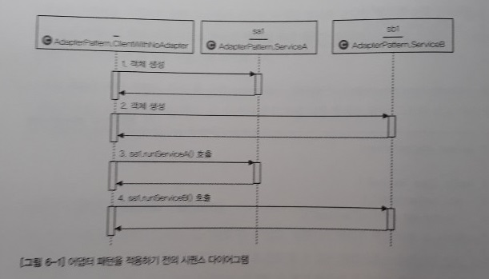
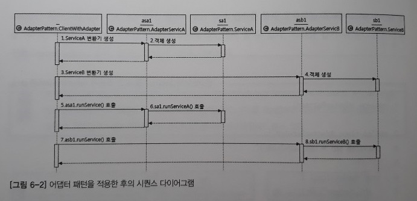
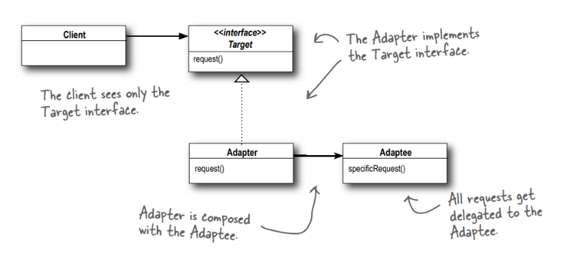
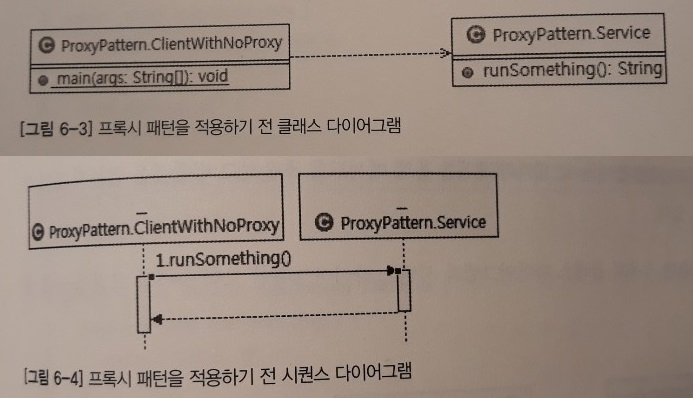
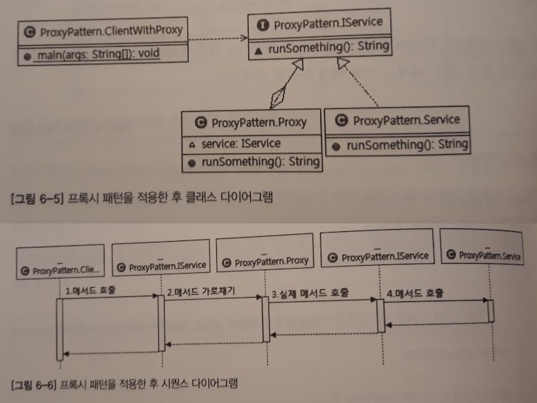

6장. 스프링이 사랑한 디자인 패턴
=====
* 주방기구: 객체 지향의 4대 특성
* 주방기구를 올바르게 사용하는 법: 객체 지향 설계의 5원칙
* 요리법, 즉 레시피: 디자인 패턴
- - -
## 목차
1. [개요](#개요)
	* [Adapter Pattern](#Adapter-Pattern)
	* [Proxy Pattern](#Proxy-Pattern)
	* [Decorator Pattern](#Decorator-Pattern)
	* Singleton Pattern
	* Template Method Pattern
	* Factory Method Pattern
	* Stragety Pattern
	* Template Callback Pattern
2. [기타](#기타)
	* 스프링이 사용한 다른 패턴들
	* [참고](#참고)

## 개요
하나의 요리에 대해 표준화된 요리법이 있듯이 프로그램을 작성하다 보면 비슷한 상황에 직면하게 되는 경우가 많은데, 그러한 상황에서 이전의 많은 개발자들이 고민하고 정제한 사실상 표준 설계 패턴이 있다. 이를 디자인 패턴이라고 한다. 스프링 역시 다양한 디자인 패턴을 활용하고 있는데 먼저 스프링의 정의를 살펴보자.

> "자바 엔터프라이즈 개발을 편하게 해주는 오픈소스 경량급 애플리케이션 프레임워크"

즉 한 마디로 **OOP 프레임워크**라고 할 수 있다. 스프링은 객체 지향의 특성과 설계 원칙을 극한까지 적용한 프레임워크이기에 스프링을 공부하다 보면 자연스럽게 객체 지향 설계의 베스트 프랙티스, 즉 디자인 패턴을 만날 수 있다. 그리고 앞으로 살펴볼 디자인 패턴은 객체 지향의 특성 중 상속(extends), 인터페이스(interface/implements), 합성(객체를 속성으로 사용)을 이용한다. 따라서 여러 디자인 패턴이 비슷하게 보일 수 있다.

##### [목차로 이동](#목차)

### Adapter Pattern
어댑터는 다시 말해 변환기(conveter)의 의미다. 변환기는 서로 다른 두 인터페이스 사이의 통신을 가능케 하는 역할을 한다. 주변에서 흔히 볼 수 있는 변환기로는 충전기가 있다. 예를 들어 휴대폰 충전기의 경우 휴대폰을 직접 전원에 연결할 수 없기 때문에 충전기가 핸드폰과 전원을 연결해주는 변환기의 역할을 수행하는 것이다.

좀 더 구체적인 예로는 ODBC/JDBC가 어댑터 패턴을 이용해 다양한 데이터베이스 시스템을 단일한 인터페이스로 조작할 수 있게 하는 것을 들 수 있다. 이는 5장 SOLID에서 개방 폐쇄 원칙(OCP)을 설명할 때도 예로 들었던 내용으로 결국 어댑터 패턴은 개방 폐쇄 원칙을 활용한 설계 패턴이라고 할 수 있다. 예제 코드를 통해 살펴보자.

* 어댑터 패턴 미적용
	* 시퀀스 다이어그램  
		</br>
		* 참조변수 `sa1`과 `sa2`를 통해 호출하는 각 메서드가 비슷한 일을 하지만 메서드명이 다름을 확인 가능
	* 코드  
		```java
		// 패키지명(adapterPattern) 생략
		
		public class ServiceA {
			void runServiceA() {
				System.out.println("ServiceA");
			}
		}
		
		public class ServiceB {
			void runServiceB() {
				System.out.println("ServiceB");
			}
		}
		
		public class ClientWithNoAdapter {
			public static void main(String[] args) {
				ServiceA sa1 = new ServiceA();
				ServiceB sb1 = new ServiceB();
				
				sa1.runServiceA();
				sb1.runServiceB();
			}
		}
		```
* 어댑터 패턴 적용
	* 시퀀스 다이어그램  
		</br>
		* 클라이언트(ClientWithAdapter)가 변환기를 통해 `runService()`라는 동일한 메서드명으로 두 객체의 메서드 호출
	* 코드  
		```java
		// 패키지명(adapterPattern) 생략
		
		public class AdapterServiceA {
			ServiceA sa1 = new ServiceA();
			
			void runService() {
				sa1.runServiceA();
			}
		}
		
		public class AdapterServiceB {
			ServiceB sb1 = new ServiceB();
			
			void runService() {
				sb1.runServiceB();
			}
		}
		
		public class ClientWithAdapter {
			public static void main(String[] args) {
				AdapterServiceA asa1 = new AdapterServiceA();
				AdapterServiceB asb1 = new AdapterServiceB();
				
				asa1.runService();
				asb1.runService();
			}
		}
		```

정리하면 어댑터 패턴은 합성, 즉 객체를 속성으로 만들어서 참조하는 디자인 패턴으로, 다음과 같이 나타낼 수 있다.

> "호출당하는 쪽의 메서드를 호출하는 쪽의 코드에 대응하도록 중간에 변환기를 통해 호출하는 패턴"

- - -
책 이외의 내용으로 어댑터 패턴에 대해 좀 더 자세히 정리한다.

* 개념
	* 클래스의 인터페이스를 **사용자가 기대하는** 다른 인터페이스로 변환하는 패턴
* 이점
	* 함께 동작할 수 없는 클래스들이 함께 작동하도록 해줌(인터페이스간 호환성 해결)
	* 즉 기존 클래스를 변경하지 않고 타겟 인터페이스에 맞춰서 동작을 가능하게 함(OCP 준수)
* UML  
	</br>
	* Target
		* 클라이언트에게 제공하는 인터페이스
	* Adapter
		* 타겟 인터페이스를 구현하며 Adaptee를 구성요소로 사용(∴ 합성)
		* 타겟 인터페이스의 요청을 Adaptee에게 **위임**(cf. 전달)
	* Adaptee
		* 요청을 위임받아 실제로 호출되는 기능을 갖고 있는 인터페이스
* 예
	* [식권 발매 시스템](https://gdtbgl93.tistory.com/141)

추후 정리.

* [자바에서는 Vector, Stack 등 옛 버전에서 사용하던 Enumeration을 Iterator로 바꾸며 어댑터 패턴 적용](https://gdtbgl93.tistory.com/141)
* [객체 어댑터와 클래스 어댑터?](https://plposer.tistory.com/23)

##### [목차로 이동](#목차)

### Proxy Pattern
프록시(Proxy)는 대리자, 대변인이라는 뜻을 가진 단어다. 즉, 다른 누군가를 대신해 그 역할을 수행하는 존재를 말한다. 디자인 패턴에서의 의미도 이와 다르지 않다.

프록시는 일종의 비서 역할로, 흐름제어만 할 뿐 결과값을 조작하거나 변경시키면 안 된다(cf. 데코레이터 패턴). 쉬운 예로 비서에게 문서를 요청하면 문서를 받아서 전달해주는 역할 이외에, 문서를 조작하면 안 되는 것과 같다.

* 프록시 패턴 미적용
	* UML  
		</br>
		* 대리자를 사용하지 않고 직접 호출하는 구조
	* 코드  
		```java
		// 패키지명 생략: proxyPattern
		public class Service {
			public String runSomething() {
				return "서비스 짱!!";
			}
		}
		
		public class ClientWithNoProxy {
			public static void main(String[] args) {
				Service service = new Service();
				System.out.println(service.runSomething());
			}
		}
		```
* 프록시 패턴 적용
	* UML  
		</br>
	* 코드  
		```java
		// 패키지명 생략: proxyPattern
		public interface IService {
			String runSomething();
		}
		
		public class Service implements IService {
			public String runSomething() {
				return "서비스 짱!!";
			}
		}
		
		public class Proxy implements IService {
			IService service1;
			
			public String runSomething() {
				System.out.println("호출에 대한 흐름 제어가 주목적, 반환 결과를 그대로 전달");
				
				service1 = new Service();
				return service1.runSomething();
			}
		}
		
		public class ClientWithProxy {
			public static void main(String[] args) {
				IService proxy = new Proxy();
				System.out.println(proxy.runSomething());
			}
		}
		```

프록시 패턴의 특징을 정리하면 다음과 같다.


- - -
추후 정리. [비교](https://hamait.tistory.com/868)
	
##### [목차로 이동](#목차)

### Decorator Pattern


##### [목차로 이동](#목차)

## 기타


##### [목차로 이동](#목차)

### 참고
* 디자인 패턴 스터디 링크
* 시퀀스 다이어그램

##### [목차로 이동](#목차)
