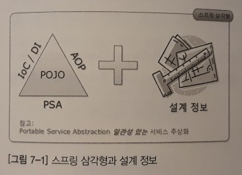
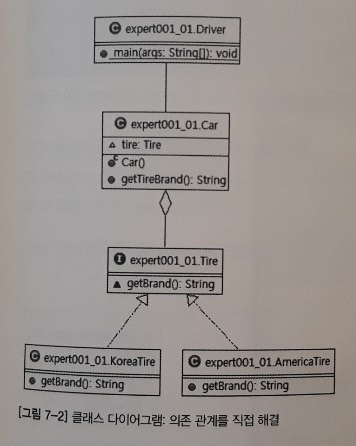
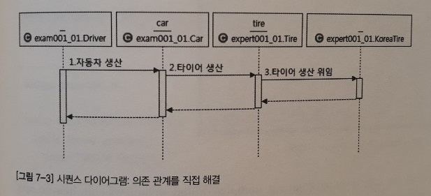
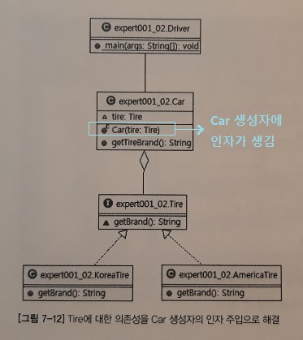
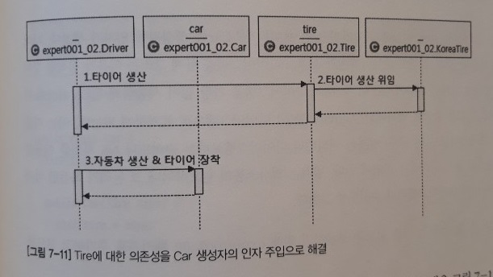
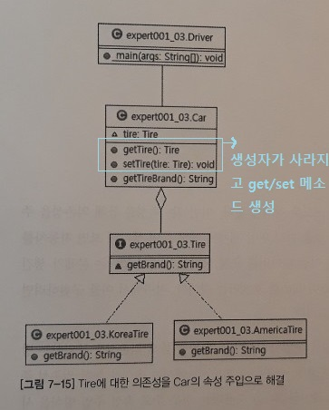
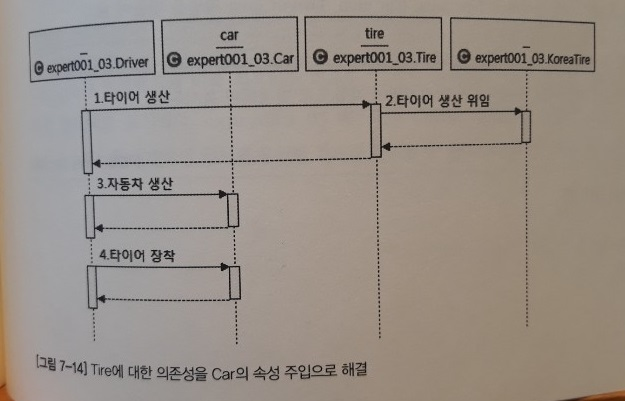
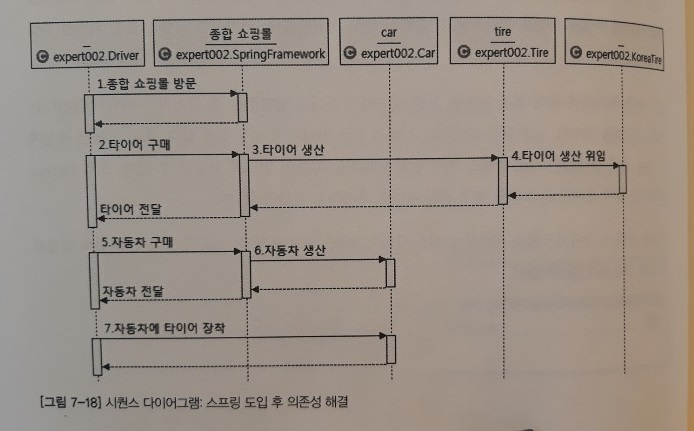
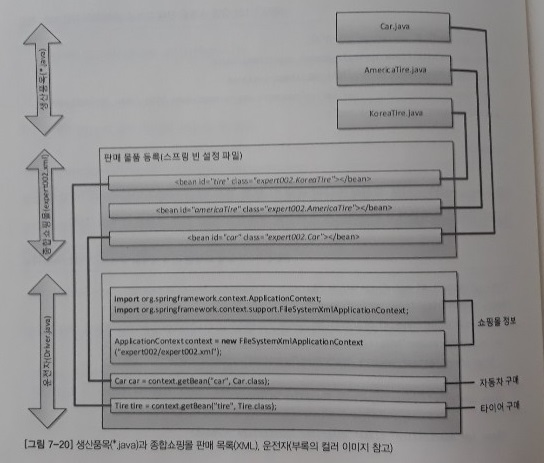
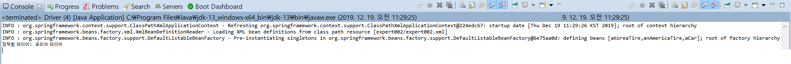

7장. 스프링 삼각형과 설정 정보
=====
## 목차
1. [개요](#개요)
2. [IoC와 DI](#IoC와-DI)
	* [의존성이란](#의존성이란)
		* [직접 의존성 해결](#직접-의존성-해결)
	* [의존성 주입](#의존성-주입)
		* [생성자](#생성자)
		* [속성](#속성)
		* [XML](#XML)
		* 어노테이션
3. [AOP](#AOP)
4. [PSA](#PSA)
5. [참고](#참고)

## 개요
1장에서 스프링 삼각형과 설정 정보에 대해 언급했었다.

</br>

스프링을 이해하는 데는 POJO(Plain Old Java Object)를 기반으로 스프링 삼각형이라는 애칭을 가진 IoC/DI, AOP, PSA라고 하는 스프링의 3대 프로그래밍 모델에 대한 이해가 필수다. 스프링 프레임워크와 스프링 삼각형의 관계는 영어 문장과 알파벳의 관계와 같다고 할 수 있다. 결국 스프링 프레임워크는 스프링 삼각형의 조합으로 이해할 수 있는 것이다.

##### [목차로 이동](#목차)

## IoC와 DI

### 의존성이란
프로그래밍에서의 의존성, 구체적으로 자바에서의 의존성이 무엇인지 알아본다.

* 의사 코드  
	```
	운전자가 자동차를 생산한다.
	자동차는 내부적으로 타이어를 생산한다.
	```
* 자바로 표현  
	```
	new Car();
	Car 객체 생성자에서 new Tire();
	```

즉 의존성을 단순하게 정의하면 다음과 같다.

> 의존성은 new다.  
> new를 실행하는 Car와 Tire 사이에서 Car가 Tire에 의존한다.

결론적으로 전체가 부분에 의존한다고 표현할 수 있다. 그리고 프로그래밍에서 의존 관계는 new로 표현된다.

- - -
더 깊이 들어가면 의존하는 객체(전체)와 의존되는 객체(부분) 사이에 집합 관계(Aggregation)와 구성 관계(Composition)로 구분할 수도 있다.

* 집합 관계: 부분이 전체와 다른 생명 주기를 가질 수 있다.
	* 예: 집 vs. 냉장고
* 구성 관계: 부분은 전체와 같은 생명 주기를 갖는다.
	* 예: 사람 vs. 심장

##### [목차로 이동](#목차)

#### 직접 의존성 해결
위에서 의존성에 관해 설명했다. 여기에선 의존이 일어나고 있는 **두 객체 사이에 의존성을 직접 해결**하는 코드를 살펴보겠다.

* UML
	* 클래스 다이어그램  
	</br>
	* 시퀀스 다이어그램  
	</br>
* 코드
	* [메인 코드](https://github.com/nara1030/spring-basic/tree/master/book/oop_for_spring_jmkim/src/ExpertSpring30/src/main/java/expert001_01)
	* [테스트 코드](https://github.com/nara1030/spring-basic/blob/master/book/oop_for_spring_jmkim/src/ExpertSpring30/src/test/java/expert001_01/CarTest.java)

##### [목차로 이동](#목차)

### 의존성 주입
위에서는 두 객체 사이에 의존성을 직접 해결했다면, 여기서부터는 의존성을 주입하는 코드를 살펴본다. 먼저 **주입**이란 무엇일까?

> 주입이란 말은 외부에서라는 뜻을 내포하고 있는 단어다.  
> 결국 자동차 내부에서 타이어를 생산하는 것이 아니라 외부에서 생산된 타이어를 자동차에 장착하는 작업이 주입이다.

##### [목차로 이동](#목차)

#### 생성자
* 의사 코드  
	```
	운전자가 타이어를 생산한다.
	운전자가 자동차를 생산하면서 타이어를 장착한다.
	```
* 자바로 표현 - 생성자 인자 이용  
	```java
	Tire aTire = new KoreaTire();
	Car aCar = new Car(tire);
	```

앞에서 [직접 의존성을 해결](#직접-의존성-해결)하는 경우 Car 객체가 Tire를 직접 생산하는, 즉 Tire에 대한 의존성을 자체적으로 해결하는 방식이었다. 이번에는 외부에서 생산된 Tire 객체를 Car 생성자의 인자로 주입(장착)하는 형태로 구현해본다.

* UML
	* 클래스 다이어그램  
	</br>
	* 시퀀스 다이어그램  
	</br>
* 코드
	* [메인 코드](https://github.com/nara1030/spring-basic/tree/master/book/oop_for_spring_jmkim/src/ExpertSpring30/src/main/java/expert001_02)
		* new를 통해 타이어를 생산하는 부분이 `Car.java`에서 `Driver.java`로 이동
		* 생산된 tire 객체 참조 변수를 Car 생성자의 인자로 전달
	* [테스트 코드](https://github.com/nara1030/spring-basic/blob/master/book/oop_for_spring_jmkim/src/ExpertSpring30/src/test/java/expert001_02/CarTest.java)

변경된 코드를 현실 세계에 비유하면 자동차가 생산될 때 어떤 타이어를 장착할까를 자동차 스스로 고민하지 않고, 운전자가 차량을 생산할 때 운전자가 어떤 타이어를 장착할까를 고민하게 하는 것이다. 자동차는 어떤 타이어를 장착할까를 더는 고민하지 않아도 된다. 이러한 구현 방식에는 어떤 장점이 있을까? 기존에 비해 더 **유연한 코드**가 된다. 왜냐하면 기존 방식에서라면 Car는 KoreaTire, AmericaTire에 대해 정확히 알고 있어야만 그에 해당하는 객체를 생성할 수 있었지만 의존성 주입을 적용할 경우 Car는 그저 Tire 인터페이스를 구현한 어떤 객체가 들어오기만 하면 정상적으로 작동되기 때문이다.

또한 의존성 주입을 하면 확장성도 좋아지는데, 나중에 ChinaTire, JapanTire, EnglandTire 등등 어떤 새로운 타이어 브랜드가 생겨도 각 타이어 브랜드들이 Tire 인터페이스를 구현한다면 Car.java 코드를 변경할 필요 없이 사용할 수 있기 때문이다. 또한 다시 컴파일할 필요도 없기에 재컴파일과 재배포에 대한 부담을 덜 수 있다. 이것은 인터페이스를 구현(준수)했기에 얻는 이점이라고 볼 수 있다.

- - -
전략 패턴. p248.

##### [목차로 이동](#목차)

#### 속성
앞에서 생성자를 통해 의존성을 주입하는 코드를 작성했다. 이는 현실 세계로 예를 들어 생각하면 자동차를 생산(구입)할 때 한 번 타이어를 장착하면 더 이상 타이어를 교체 장착할 방법이 없다는 문제가 생긴다. 더 현실적인 방법은 운전자가 원할 때 Car(aCar)의 Tire(aTire)를 교체하는 것이다. 자바에서 이를 구현하려면 생성자가 아닌 속성을 통한 의존성 주입이 필요하다.

실제로 대부분의 프로젝트에서는 생성자를 통한 방식보다는 속성을 통한 의존성 주입을 선호하는 듯하다. 특히 스프링에서 애노테이션(@)을 사용하는 경우 주로 속성 주입 방식을 사용하게 된다.

* 의사 코드  
	```
	운전자가 타이어를 생산한다.
	운전자가 자동차를 생산한다.
	운전자가 자동차에 타이어를 장착한다.
	```
* 자바로 표현 - 속성 접근자 메서드 사용  
	```java
	Tire aTire = new KoreaTire();
	Car aCar = new Car();
	aCar.setTire(aTire);
	```

* UML
	* 클래스 다이어그램  
	</br>
	* 시퀀스 다이어그램  
	</br>
* 코드
	* [메인 코드](https://github.com/nara1030/spring-basic/tree/master/book/oop_for_spring_jmkim/src/ExpertSpring30/src/main/java/expert001_03)
		* Car 클래스에서 생성자가 사라지고 tire 속성의 get/set 속성 메서드 생성
		* 자바 컴파일러가 기본 생성자 제공
	* [테스트 코드](https://github.com/nara1030/spring-basic/blob/master/book/oop_for_spring_jmkim/src/ExpertSpring30/src/test/java/expert001_03/CarTest.java)

##### [목차로 이동](#목차)

#### XML
지금까지는 스프링을 사용하지 않고 의존성을 주입했다. 이제는 스프링을 이용해 의존성을 주입해본다. 스프링을 통한 의존성 주입은 생성자를 통한 의존성 주입과 속성을 통한 의존성 주입을 모두 지원하는데, 여기서는 속성을 통한 의존성 주입만 살펴본다.

* 의사 코드  
	```
	운전자가 종합 쇼핑몰에서 타이어를 구매한다.
	운전자가 종합 쇼핑몰에서 자동차를 구매한다.
	운전자가 자동차에 타이어를 장착한다.
	```
* 자바로 표현 - 속성 메서드 사용  
	```java
	ApplicationContext context = new ClassPathXmlApplicationContext("expert002.xml", Driver.class);
	Tire aTire = (Tire) context.getBean("aTire");
	Car aCar = (Car) context.getBean("aCar");
	aCar.setTire(aTire);
	```

의사 코드를 보면 기존과 달라진 점은 종합 쇼핑몰이 생기고 생산이 구매로 바뀌었음을 확인할 수 있다.

* UML
	* 클래스 다이어그램: [기존](#속성)과 동일
	* 시퀀스 다이어그램  
	</br>
* 코드
	* [메인 코드](https://github.com/nara1030/spring-basic/tree/master/book/oop_for_spring_jmkim/src/ExpertSpring30/src/main/java/expert002)
		* `Driver.java`에서 기존 생산 과정이 구매 과정으로 바뀜
			* 상품을 구매할 종합 쇼핑몰에 대한 정보가 필요하기 때문
		* `expert002.xml`에 쇼핑몰에서 구매 가능한 상품 목록 등록
			* New → Other → Spring → Spring Bean Configuration File 
			* 상품을 등록할 때는 bean 태그 이용
	* [테스트 코드](https://github.com/nara1030/spring-basic/blob/master/book/oop_for_spring_jmkim/src/ExpertSpring30/src/test/java/expert002/CarTest.java)

좀 더 상세히 이해하기 위해 `Driver.java`와 `expert002.xml`를 함께 볼 필요가 있다.

</br>

`KoreaTire.java`가 XML 파일에서 id=aKoreaTire인 bean 태그와 연결돼 있고, 다시 `Driver.java`의 main() 메서드 안의 코드인 context.getBean("aKoreaTire", Tire.class)와 연결돼 있는 것을 볼 수 있다(책과 변수명 상이). 이를 실행한 결과는 다음과 같다.

</br>

기존과 같은 결과이지만 INFO와 관련된 세 줄이 다름을 볼 수 있다. 이는 내부적으로 쇼핑몰(스프링 프레임워크)을 구축하는 과정에서 보여지는 정보라고 생각하면 된다.

스프링을 도입해서 얻는 이득은 무엇일까? 가장 큰 이점은 자동차의 타이어 브랜드를 변경할 때 그 무엇도 재컴파일/재배포하지 않아도 XML 파일만 수정하면 프로그램의 실행 결과를 바꿀 수가 있다는 것이다. 아래 `Driver.java`를 보면 자바 코드 어디에도 KoreaTire 클래스나 AmericaTire 클래스를 지칭하는 부분이 없다.

```java
Tire aTire = context.getBean("aTire", Tire.class);
```

바로 `expert002.xml`에 이에 해당하는 내용이 있기 때문이다. 지금은 `expert002.xml`에서 id가 aTire인 bean 태그의 class 어트리뷰터가 KoreaTire로 지정되어 있는데 아래와 같이 AmericaTire로 타이어를 바꿔야 하더라도 자바 코드를 변경/재컴파일/재배포할 필요가 없다. XML 파일을 변경하고 프로그램을 실행하면 바로 변경사항이 적용되기 때문이다.

```xml
<bean id="aKoreaTire" class="expert002.KoreaTire"></bean>
<bean id="aTire" class="expert002.AmericaTire"></bean>
```

##### [목차로 이동](#목차)

## AOP


##### [목차로 이동](#목차)

## PSA


##### [목차로 이동](#목차)

## 참고


##### [목차로 이동](#목차)
