7장. 스프링 삼각형과 설정 정보
=====
## 목차
1. [개요](#개요)
2. [IoC와 DI](#IoC와-DI)
	* [의존성이란](#의존성이란)
		* [직접 의존성 해결](#직접-의존성-해결)
	* [의존성 주입](#의존성-주입)
		* [생성자](#생성자)
		* [속성](#속성)
		* [XML](#XML)
		* [어노테이션](#어노테이션)
			* @Resource vs `<property>`
3. [AOP](#AOP)
	* [이론](#이론)
	* [용어](#용어)
4. [PSA](#PSA)
5. [참고](#참고)
	* [어노테이션 속성 매칭 규칙](#어노테이션-속성-매칭-규칙)
	* XML vs 어노테이션
	* [참고문헌](#참고문헌)

## 개요
1장에서 스프링 삼각형과 설정 정보에 대해 언급했었다.

</br>

스프링을 이해하는 데는 POJO(Plain Old Java Object)를 기반으로 스프링 삼각형이라는 애칭을 가진 IoC/DI, AOP, PSA라고 하는 스프링의 3대 프로그래밍 모델에 대한 이해가 필수다. 스프링 프레임워크와 스프링 삼각형의 관계는 영어 문장과 알파벳의 관계와 같다고 할 수 있다. 결국 스프링 프레임워크는 스프링 삼각형의 조합으로 이해할 수 있는 것이다.

##### [목차로 이동](#목차)

## IoC와 DI

### 의존성이란
프로그래밍에서의 의존성, 구체적으로 자바에서의 의존성이 무엇인지 알아본다.

* 의사 코드  
	```
	운전자가 자동차를 생산한다.
	자동차는 내부적으로 타이어를 생산한다.
	```
* 자바로 표현  
	```
	new Car();
	Car 객체 생성자에서 new Tire();
	```

즉 의존성을 단순하게 정의하면 다음과 같다.

> 의존성은 new다.  
> new를 실행하는 Car와 Tire 사이에서 Car가 Tire에 의존한다.

결론적으로 전체가 부분에 의존한다고 표현할 수 있다. 그리고 프로그래밍에서 의존 관계는 new로 표현된다.

- - -
더 깊이 들어가면 의존하는 객체(전체)와 의존되는 객체(부분) 사이에 집합 관계(Aggregation)와 구성 관계(Composition)로 구분할 수도 있다.

* 집합 관계: 부분이 전체와 다른 생명 주기를 가질 수 있다.
	* 예: 집 vs. 냉장고
* 구성 관계: 부분은 전체와 같은 생명 주기를 갖는다.
	* 예: 사람 vs. 심장

##### [목차로 이동](#목차)

#### 직접 의존성 해결
위에서 의존성에 관해 설명했다. 여기에선 의존이 일어나고 있는 **두 객체 사이에 의존성을 직접 해결**하는 코드를 살펴보겠다.

* UML
	* 클래스 다이어그램  
	</br>
	* 시퀀스 다이어그램  
	</br>
* 코드
	* [메인 코드](https://github.com/nara1030/spring-basic/tree/master/book/oop_for_spring_jmkim/src/ExpertSpring30/src/main/java/expert001_01)
	* [테스트 코드](https://github.com/nara1030/spring-basic/blob/master/book/oop_for_spring_jmkim/src/ExpertSpring30/src/test/java/expert001_01/CarTest.java)

##### [목차로 이동](#목차)

### 의존성 주입
위에서는 두 객체 사이에 의존성을 직접 해결했다면, 여기서부터는 의존성을 주입하는 코드를 살펴본다. 먼저 **주입**이란 무엇일까?

> 주입이란 말은 외부에서라는 뜻을 내포하고 있는 단어다.  
> 결국 자동차 내부에서 타이어를 생산하는 것이 아니라 외부에서 생산된 타이어를 자동차에 장착하는 작업이 주입이다.

##### [목차로 이동](#목차)

#### 생성자
* 의사 코드  
	```
	운전자가 타이어를 생산한다.
	운전자가 자동차를 생산하면서 타이어를 장착한다.
	```
* 자바로 표현 - 생성자 인자 이용  
	```java
	Tire aTire = new KoreaTire();
	Car aCar = new Car(tire);
	```

앞에서 [직접 의존성을 해결](#직접-의존성-해결)하는 경우 Car 객체가 Tire를 직접 생산하는, 즉 Tire에 대한 의존성을 자체적으로 해결하는 방식이었다. 이번에는 외부에서 생산된 Tire 객체를 Car 생성자의 인자로 주입(장착)하는 형태로 구현해본다.

* UML
	* 클래스 다이어그램  
	</br>
	* 시퀀스 다이어그램  
	</br>
* 코드
	* [메인 코드](https://github.com/nara1030/spring-basic/tree/master/book/oop_for_spring_jmkim/src/ExpertSpring30/src/main/java/expert001_02)
		* new를 통해 타이어를 생산하는 부분이 `Car.java`에서 `Driver.java`로 이동
		* 생산된 tire 객체 참조 변수를 Car 생성자의 인자로 전달
	* [테스트 코드](https://github.com/nara1030/spring-basic/blob/master/book/oop_for_spring_jmkim/src/ExpertSpring30/src/test/java/expert001_02/CarTest.java)

변경된 코드를 현실 세계에 비유하면 자동차가 생산될 때 어떤 타이어를 장착할까를 자동차 스스로 고민하지 않고, 운전자가 차량을 생산할 때 운전자가 어떤 타이어를 장착할까를 고민하게 하는 것이다. 자동차는 어떤 타이어를 장착할까를 더는 고민하지 않아도 된다. 이러한 구현 방식에는 어떤 장점이 있을까? 기존에 비해 더 **유연한 코드**가 된다. 왜냐하면 기존 방식에서라면 Car는 KoreaTire, AmericaTire에 대해 정확히 알고 있어야만 그에 해당하는 객체를 생성할 수 있었지만 의존성 주입을 적용할 경우 Car는 그저 Tire 인터페이스를 구현한 어떤 객체가 들어오기만 하면 정상적으로 작동되기 때문이다.

또한 의존성 주입을 하면 확장성도 좋아지는데, 나중에 ChinaTire, JapanTire, EnglandTire 등등 어떤 새로운 타이어 브랜드가 생겨도 각 타이어 브랜드들이 Tire 인터페이스를 구현한다면 Car.java 코드를 변경할 필요 없이 사용할 수 있기 때문이다. 또한 다시 컴파일할 필요도 없기에 재컴파일과 재배포에 대한 부담을 덜 수 있다. 이것은 인터페이스를 구현(준수)했기에 얻는 이점이라고 볼 수 있다.

- - -
전략 패턴. p248.

##### [목차로 이동](#목차)

#### 속성
앞에서 생성자를 통해 의존성을 주입하는 코드를 작성했다. 이는 현실 세계로 예를 들어 생각하면 자동차를 생산(구입)할 때 한 번 타이어를 장착하면 더 이상 타이어를 교체 장착할 방법이 없다는 문제가 생긴다. 더 현실적인 방법은 운전자가 원할 때 Car(aCar)의 Tire(aTire)를 교체하는 것이다. 자바에서 이를 구현하려면 생성자가 아닌 속성을 통한 의존성 주입이 필요하다.

실제로 대부분의 프로젝트에서는 생성자를 통한 방식보다는 속성을 통한 의존성 주입을 선호하는 듯하다. 특히 스프링에서 애노테이션(@)을 사용하는 경우 주로 속성 주입 방식을 사용하게 된다.

* 의사 코드  
	```
	운전자가 타이어를 생산한다.
	운전자가 자동차를 생산한다.
	운전자가 자동차에 타이어를 장착한다.
	```
* 자바로 표현 - 속성 접근자 메서드 사용  
	```java
	Tire aTire = new KoreaTire();
	Car aCar = new Car();
	aCar.setTire(aTire);
	```

* UML
	* 클래스 다이어그램  
	</br>
	* 시퀀스 다이어그램  
	</br>
* 코드
	* [메인 코드](https://github.com/nara1030/spring-basic/tree/master/book/oop_for_spring_jmkim/src/ExpertSpring30/src/main/java/expert001_03)
		* Car 클래스에서 생성자가 사라지고 tire 속성의 get/set 속성 메서드 생성
		* 자바 컴파일러가 기본 생성자 제공
	* [테스트 코드](https://github.com/nara1030/spring-basic/blob/master/book/oop_for_spring_jmkim/src/ExpertSpring30/src/test/java/expert001_03/CarTest.java)

##### [목차로 이동](#목차)

#### XML
지금까지는 스프링을 사용하지 않고 의존성을 주입했다. 이제는 스프링을 이용해 의존성을 주입해본다. 스프링을 통한 의존성 주입은 생성자를 통한 의존성 주입과 속성을 통한 의존성 주입을 모두 지원하는데, 여기서는 속성을 통한 의존성 주입만 살펴본다.

* 의사 코드  
	```
	운전자가 종합 쇼핑몰에서 타이어를 구매한다.
	운전자가 종합 쇼핑몰에서 자동차를 구매한다.
	운전자가 자동차에 타이어를 장착한다.
	```
* 자바로 표현 - 속성 메서드 사용  
	```java
	ApplicationContext context = new ClassPathXmlApplicationContext("expert002.xml", Driver.class);
	Tire aTire = (Tire) context.getBean("aTire");
	Car aCar = (Car) context.getBean("aCar");
	aCar.setTire(aTire);
	```

의사 코드를 보면 기존과 달라진 점은 종합 쇼핑몰이 생기고 생산이 구매로 바뀌었음을 확인할 수 있다.

* UML
	* 클래스 다이어그램: [기존](#속성)과 동일
	* 시퀀스 다이어그램  
	</br>
* 코드
	* [메인 코드](https://github.com/nara1030/spring-basic/tree/master/book/oop_for_spring_jmkim/src/ExpertSpring30/src/main/java/expert002)
		* `Driver.java`에서 기존 생산 과정이 구매 과정으로 바뀜
			* 상품을 구매할 종합 쇼핑몰에 대한 정보가 필요하기 때문
		* `expert002.xml`에 쇼핑몰에서 구매 가능한 상품 목록 등록
			* New → Other → Spring → Spring Bean Configuration File 
			* 상품을 등록할 때는 bean 태그 이용
	* [테스트 코드](https://github.com/nara1030/spring-basic/blob/master/book/oop_for_spring_jmkim/src/ExpertSpring30/src/test/java/expert002/CarTest.java)

좀 더 상세히 이해하기 위해 `Driver.java`와 `expert002.xml`를 함께 볼 필요가 있다.

</br>

`KoreaTire.java`가 XML 파일에서 id=aKoreaTire인 bean 태그와 연결돼 있고, 다시 `Driver.java`의 main() 메서드 안의 코드인 context.getBean("aKoreaTire", Tire.class)와 연결돼 있는 것을 볼 수 있다(책과 변수명 상이). 이를 실행한 결과는 다음과 같다.

</br>

기존과 같은 결과이지만 INFO와 관련된 세 줄이 다름을 볼 수 있다. 이는 내부적으로 쇼핑몰(스프링 프레임워크)을 구축하는 과정에서 보여지는 정보라고 생각하면 된다.

스프링을 도입해서 얻는 이득은 무엇일까? 가장 큰 이점은 자동차의 타이어 브랜드를 변경할 때 그 무엇도 재컴파일/재배포하지 않아도 XML 파일만 수정하면 프로그램의 실행 결과를 바꿀 수가 있다는 것이다. 아래 `Driver.java`를 보면 자바 코드 어디에도 KoreaTire 클래스나 AmericaTire 클래스를 지칭하는 부분이 없다.

```java
Tire aTire = context.getBean("aTire", Tire.class);
```

바로 `expert002.xml`에 이에 해당하는 내용이 있기 때문이다. 지금은 `expert002.xml`에서 id가 aTire인 bean 태그의 class 어트리뷰터가 KoreaTire로 지정되어 있는데 아래와 같이 AmericaTire로 타이어를 바꿔야 하더라도 자바 코드를 변경/재컴파일/재배포할 필요가 없다. XML 파일을 변경하고 프로그램을 실행하면 바로 변경사항이 적용되기 때문이다.

```xml
<bean id="aKoreaTire" class="expert002.KoreaTire"></bean>
<bean id="aTire" class="expert002.AmericaTire"></bean>
```

이번엔 좀 더 나아가서 스프링 설정 파일(XML)에서 속성을 주입해본다.

* 의사 코드  
	```
	운전자가 종합 쇼핑몰에서 자동차를 구매 요청한다.
	종합 쇼핑몰은 자동차를 생산한다.
	종합 쇼핑몰은 타이어를 생산한다.
	종합 쇼핑몰은 자동차에 타이어를 장착한다.
	종합 쇼핑몰은 운전자에게 자동차를 전달한다.
	```
* 자바로 표현  
	```java
	ApplicationContext context = new ClassPathXmlApplicationContext("expert003/expert003.xml);
	Car car = context.getBean("car", Car.class);
	```
* XML로 표현  
	```xml
	<bean id="aKoreaTire" class="expert003.KoreaTire"></bean>
	<bean id="anAmericaTire" class="expert003.AmericaTire"></bean>
	<bean id="aCar" class="expert003.Car">
		<property name="tire" ref="aKoreaTire"></property>
	</bean>
	```

시퀀스 다이어그램이 앞에서와 조금 달라졌다.

* UML
	* 클래스 다이어그램: [기존](#속성)과 동일
	* 시퀀스 다이어그램  
	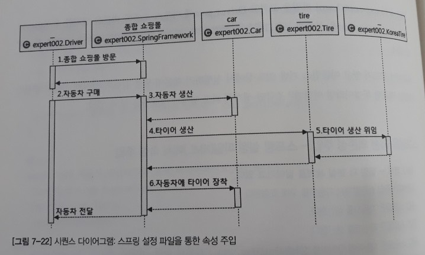</br>
* 코드
	* [메인 코드](https://github.com/nara1030/spring-basic/tree/master/book/oop_for_spring_jmkim/src/ExpertSpring30/src/main/java/expert003)
	* [테스트 코드](https://github.com/nara1030/spring-basic/blob/master/book/oop_for_spring_jmkim/src/ExpertSpring30/src/test/java/expert003/CarTest.java): `재확인`
		* JUnit 및 Spring-Test 사용

XML 파일에 새롭게 property라고 하는 부분이 보인다. 자바에서 접근자 및 설정자 메서드를 속성 메서드라고 하는데 영어로 속성은 Property다. 결국 `Driver.java`에서 car.setTire(tire)라고 하던 부분을 XML 파일의 property 태그를 이용해 대체하는 것이다. 즉 스프링 설정 파일을 통해 의존성 주입이 이루어지고 있다.

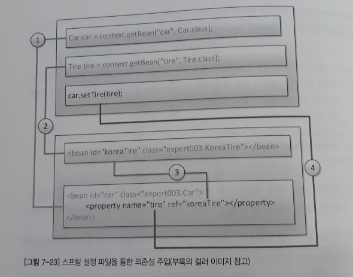</br>

- - -
XML로 속성 주입 시 property의 name에 tire 이외의 단어를 치면 에러가 떴다(ex.koreaTire, americaTire). 해서 Car 클래스의 Tire 속성의 변수명(aTire)을 입력해주면 될 줄 알았으나 에러가 떴다(`No setter found for property 'aTire' in class 'expert003.Car'`). 이 부분 확인 필요.

##### [목차로 이동](#목차)

#### 어노테이션
앞에서 스프링을 통한 의존성 주입을 위해 XML을 이용했다. 이번엔 어노테이션을 이용해 속성을 주입하는 두 가지 방법을 알아보겠다. 먼저 @Autowired를 통한 속성 주입을 알아보겠다. 의사 코드는 이전(XML)과 동일하다.

* 의사 코드  
	```
	운전자가 종합 쇼핑몰에서 자동차를 구매 요청한다.
	종합 쇼핑몰은 자동차를 생산한다.
	종합 쇼핑몰은 타이어를 생산한다.
	종합 쇼핑몰은 자동차에 타이어를 장착한다.
	종합 쇼핑몰은 운전자에게 자동차를 전달한다.
	```

달라진 점은 기존에는 설정자 메서드를 통해 Car 객체에 tire 값을 주입했지만 이제는 import문 하나와 @Autowired 애노테이션을 이용해 손쉽게 종합 쇼핑몰인 스프링 프레임워크가 설정 파일을 통해 속성을 주입해준다는 점이다. 직접 코드를 비교해보면 아래와 같다.

* 기존 코드  
	```java
	// Car 클래스
	Tire tire;
	
	public void setTire(Tire tire) {
		this.tire = tire;
	}
	```
* 변경된 코드  
	```java
	import org.springframework.beans.factory.annotation.Autowired;
	
	@Autowired
	Tire tire;
	```

애노테이션을 이용하기 위해 변경된 스프링 설정 파일(expert004.xml)에서 변경된 부분(빨간색 네모칸)을 살펴보자.

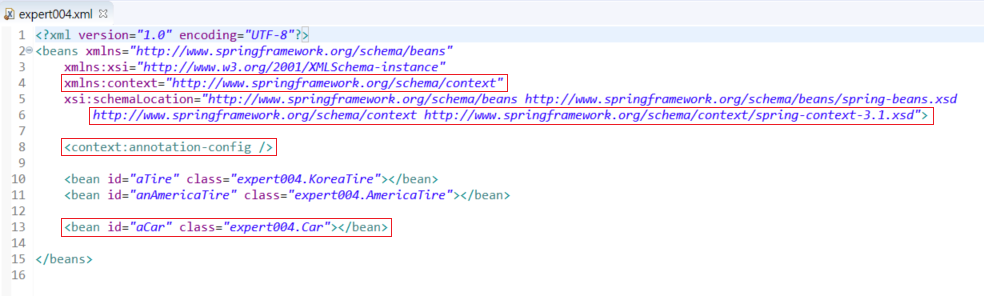</br>

기존 설정 관련 추가된 부분은 다음 과정을 통해 추가할 수 있다.

```txt
expert004.xml 파일 마우스 우클릭
→ Open With
→ Spring Config Editor
→ Namespace 탭에서 context 체크
→ Source 탭에서 아래 문구 추가
  <context:annotation-config/>
```

또한 XML을 통한 속성 주입시와 달라진 부분은 아래와 같다.

* 기존 XML 설정 파일  
	```xml
	<bean id="aCar" class="expert003.Car">
		<property name="tire" ref="koreaTire"></property>
	</bean>
	```
* 수정된 XML 설정 파일  
	```xml
	<bean id="aCar" class="expert004.Car"></bean>
	```

왜 property 태그가 사라졌을까? @Autowired를 통해 aCar의 property를 자동으로 엮어줄 수 있으므로(자동 의존성 주입) 생략이 가능해진 것이다. 즉 @Autowired는 **스프링 설정 파일을 보고 자동으로 속성의 설정자 메서드에 해당하는 역할을 해주겠다**는 의미다.

* 코드
	* [메인 코드](https://github.com/nara1030/spring-basic/tree/master/book/oop_for_spring_jmkim/src/ExpertSpring30/src/main/java/expert004)
	* 테스트 코드

참고로 실행결과는 아래와 같다. XML을 통한 속성 주입에 비해 스프링이 내부적으로 준비하는 INFO 정보가 더 늘어났음을 확인할 수 있다.
	
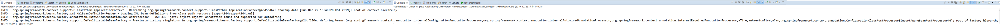</br>

지금까지는 @Autowired를 통해 속성을 주입했었는데, 이제는 @Resource를 통한 속성 주입을 살펴본다. 의사 코드는 이전과 동일하다.

* 의사 코드  
	```
	운전자가 종합 쇼핑몰에서 자동차를 구매 요청한다.
	종합 쇼핑몰은 자동차를 생산한다.
	종합 쇼핑몰은 타이어를 생산한다.
	종합 쇼핑몰은 자동차에 타이어를 장착한다.
	종합 쇼핑몰은 운전자에게 자동차를 전달한다.
	```

코드의 경우도 @Autowired가 @Resource로 변경되었을 뿐 동일하다. 그렇다면 굳이 왜 변경했는가? @Autowired는 스프링의 어노테이션인 반면 @Resource는 자바 표준 어노테이션이다. 즉 스프링 프레임워크를 사용하지 않는다면 @Autowired는 사용할 수 없고 오직 @Resource만을 사용해야 한다. 또한 이미 살펴봤듯 @Autowired의 경우 type과 id 가운데 type이 매칭 우선 순위가 높지만 @Resource의 경우는 그 반대다. 즉 @Resource의 경우 id로 매칭할 빈을 찾지 못한 경우 type으로 매칭할 빈을 찾게 된다. 정리하면 아래와 같다.

| | @Autowired | @Resource |
| -- | -- | -- |
| 출처 | 스프링 프레임워크 | 표준 자바 |
| 소속 패키지 | org.springframework.beans.factory.annotation.Autowired | javax.annotation.Resource |
| 빈 검색 방식 | byType 먼저, 못 찾으면 byName | byName 먼저, 못 찾으면 byType |
| 특이사항 | @Qualifier("") 협업 | name 어트리뷰트 |
| byName 강제하기 | @Autowired \n @Qualifier("tire1") | @Resource(name="tire1") |

* 코드
	* [메인 코드](https://github.com/nara1030/spring-basic/tree/master/book/oop_for_spring_jmkim/src/ExpertSpring30/src/main/java/expert005)
	* 테스트 코드

- - -
p281. @Resource vs `<property>`.

##### [목차로 이동](#목차)

## AOP
스프링의 3대 프로그래밍 모델 중 두 번째는 AOP(Aspect-Oriented Programming), 즉 관점 지향 프로그래밍이다. 스프링 DI가 의존성(new)에 대한 주입이라면 스프링 AOP는 로직(code) 주입이라고 할 수 있다.

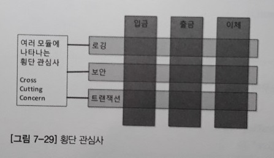</br>

위 그림을 보면 입금, 출금, 이체 모듈에서 로깅, 보안, 트랜잭션 기능이 반복적으로 나타나는 것을 볼 수 있다. 이처럼 다수의 모듈에 공통적으로 나타나는 부분이 존재하는데, 이것을 횡단 관심사(cross-cutting concern)라고 한다. 다른 예를 들어보자.

```java
DB 커넥션 준비
Statement 객체 준비

try {
	DB 커넥션 연결
	Statement 객체 세팅
	*****insert / update / delete / select 실행*****
} catch ... {
	예외 처리
} catch ... {
	예외 처리
} finally {
	DB 자원 반납
}
```

이는 데이터베이스 연동 프로그램에서 연산에 관계없이 항상 반복해서 등장하는 코드인데, 이를 횡단 관심사라고 한다. 그리고 별표에 둘러싸인 부분을 핵심 관심사라고 한다.

> 코드 = 핵심 관심사 + 횡단 관심사

핵심 관심사는 모듈별로 다르지만 횡단 관심사는 반복/중복되어 나타나는 부분이다. 반복/중복은 분리해서 한 곳에서 관리하는 원칙이 있지만 AOP에서는 더 진보된 방법을 사용한다. 다음 코드를 수정해가면서 살펴보기로 한다.

* 의사 코드(남자 / 여자)  
	```txt
	열쇠로 문을 열고 집에 들어간다.
	컴퓨터로 게임을 한다. / 요리를 한다.
	소등하고 잔다.
	자물쇠를 잠그고 집을 나선다.
	----
	예외상황처리: 집에 불남 - 119에 신고한다.
	```

이를 구현한 코드는 [다음](https://github.com/nara1030/spring-basic/tree/master/book/oop_for_spring_jmkim/src/ExpertSpring30/src/main/java/aop001)과 같고 그 실행결과는 아래와 같다.

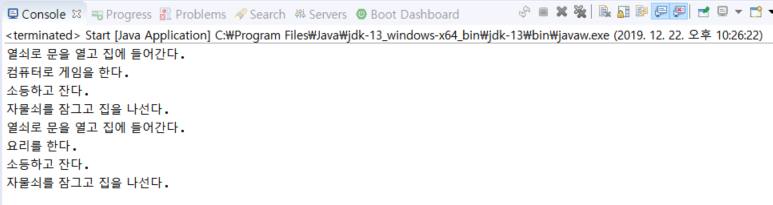</br>

한편 스프링 DI가 의존성에 대한 주입이라면 스프링 AOP는 로직 주입이라고 했는데, 로직은 어디에 주입할 수 있을까? 객체 지향에서 로직(코드)이 있는 곳은 당연히 메서드의 안쪽이다. 그럼 메서드에서 코드를 주입할 수 있는 곳은 몇 군데일까?

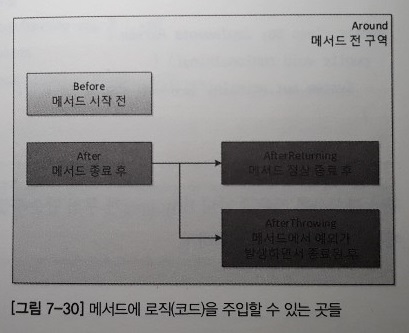</br>

위에서 볼 수 있듯 총 다섯 군데다.

* Around
* Before
* After
* AfterReturning
* AfterThrowing

직접 코드를 통해 살펴본다. 전체 코드는 [다음](https://github.com/nara1030/spring-basic/tree/master/book/oop_for_spring_jmkim/src/ExpertSpring30/src/main/java/aop002)에서 확인 가능하다. 

* XML 설정 파일  
	```xml
	<aop:aspectj-autoproxy />
	
	<bean id="myAspect" class="aop002.MyAspect" />
	<bean id="boy" class="aop002.Boy" />
	```
* 자바 파일  
	```java
	package aop002;

	// import org.aopalliance.intercept.Joinpoint;
	import org.aspectj.lang.JoinPoint;
	import org.aspectj.lang.annotation.Aspect;
	import org.aspectj.lang.annotation.Before;

	@Aspect
	public class MyAspect {
		@Before("excution(public void aop002.Boy.runSomething())")
		public void before(JoinPoint joinPoint) {
			System.out.println("얼굴 인식 확인: 문을 개방하라");
			// System.out.println("열쇠로 문을 열고 집에 들어간다.");
		}
	}
	```

이에 대한 실행결과는 다음과 같다.

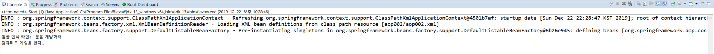</br>

즉 이제 열쇠로 문을 열고 들어가는 것이 아니라 스프링 프레임워크가 사용자를 인식해 자동으로 문을 열어주게 된다. 간략하게 어노테이션에 대한 설명을 덧붙인다.

* @Aspect는 해당 클래스를 AOP에서 사용하겠다는 의미
* @Before는 대상 메서드 실행 전에 해당 메서드를 실행하겠다는 의미
* JoinPoint는 대상 메서드, 즉 @Before에서 선언된 메서드인 `aop002.Boy.runSomething()`를 의미

- - -
에러. p291.

##### [목차로 이동](#목차)

### 이론
앞의 예제에 대해 좀 더 살펴보자.

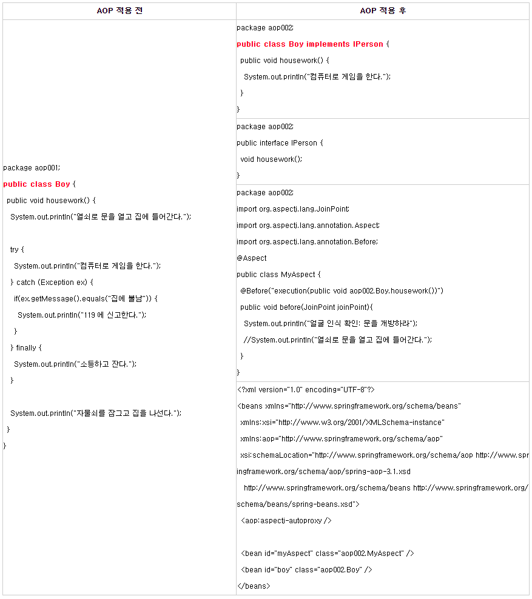</br>

aop001 코드에 비해 [aop003 코드](https://github.com/nara1030/spring-basic/tree/master/book/oop_for_spring_jmkim/src/ExpertSpring30/src/main/java/aop003)의 양이 상당히 많이 늘어났음을 알 수 있다. 하지만 주목할 것은 `Boy.java`의 코드에서 횡단 관심사는 모두 사라지고 핵심 관심사만 남았다는 점이다. 즉 개발할 때는 한 개의 `Boy.java`를 4개의 파일로 분할해서 개발해야 하지만 추가 개발과 유지보수 관점에서 보면 무척 유리하다. 또한 AOP를 적용함으로써 `Boy.java`에 단일 책임 원칙(SRP)이 자연스럽게 적용되었다.

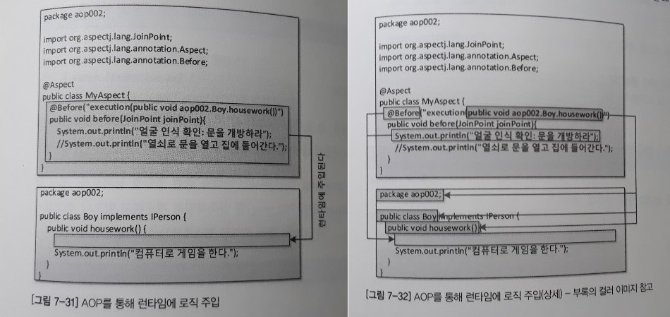</br>

위 그림은 AOP를 통해 런타임에 로직이 주입되는 것을 나타낸다. 예제의 실행 결과 역시 @Before로 만들어진 before 메서드가 런타임에 위 그림에서처럼 주입되는 것을 보여주고 있다. 결론적으로 AOP 적용 전과 적용 후는 아래와 같이 정리할 수 있다.

* 기존 자바 코드(`Boy.java`와 `Girl.java`)에서 횡단 관심사 제거(∵ 중복 제거)
* 공통 인터페이스(`Person.java`) 구현(∵ 스프링 AOP가 인터페이스 기반으로 작동하기 때문)
	* 예외적으로 CGLIB 라이브러리 사용하면 인터페이스 없이도 AOP 적용 가능하지만 권장하지 않음
* 횡단 관심사는 한 곳(`MyAspect.java`)에서 처리
* `aop003.xml`에서 빈 설정
	* 객체의 생성(뿐 아니라 생명주기 전반에 걸친 빈의 소멸까지)과 의존성 주입을 스프링 프레임워크에 위임하기 위해
	* AOP 적용 대상: `aBoy` 빈, `aGirl` 빈
	* AOP의 Aspect: `MyAspect` 빈

또한 XML 설정 파일에서 `<aop:aspectj-autoproxy />`을 추가해주었다. 이는 한마디로 프록시 패턴을 이용해 횡단 관심사를 핵심 관심사에 주입하는 것이다.

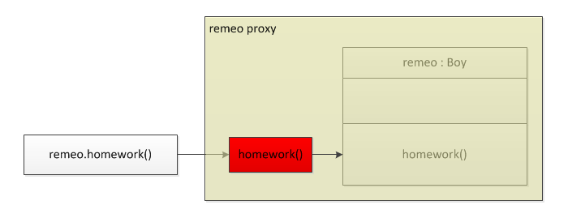</br>

결국, `<aop:aspectj-autoproxy />`는 스프링 프레임워크에게 AOP 프록시를 사용하라고 알려주는 지시자인 것이다. 정리하면 스프링 AOP는 다음 세 문장으로 요약할 수 있다.

* 스프링 AOP는 인터페이스(interface) 기반이다.
* 스프링 AOP는 프록시(proxy) 기반이다.
* 스프링 AOP는 런타임(runtime) 기반이다.

- - -
위의 인터페이스는 자바 고유명사, 즉 추상클래스는 해당사항이 없는 것인가?

* [참고](https://interwater.tistory.com/entry/Spring-AOP)

##### [목차로 이동](#목차)

### 용어


##### [목차로 이동](#목차)

## PSA


##### [목차로 이동](#목차)

## 참고

### 어노테이션 속성 매칭 규칙
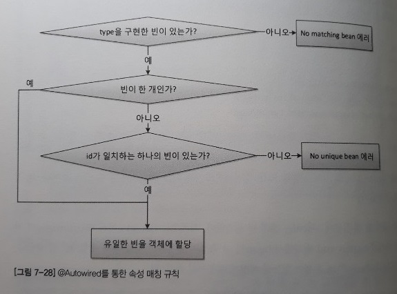</br>

위 매칭 규칙을 보면 두 가지를 확인할 수 있다.

* 스프링의 @Autowired는 id 매칭보다 type 매칭이 우선
* 인터페이스 구현 여부 중요

따라서 아래와 같이 bean의 id 속성이 없음에도 매칭시킨 것이다.

| 파일 | 코드 |
| -- | -- |
| Car.java | @Autowired Tire tire; |
| expert.xml | `<bean class="expert004.AmericaTire"></bean>` |
| AmericaTire.java | public class AmericaTire implements Tire |

다른 사례들의 경우에도 매칭 여부를 판단해볼 수 있다.

#### 사례-1: O
| 파일 | 코드 |
| -- | -- |
| Car.java | @Autowired Tire tire; |
| expert.xml | `<bean id="usaTire" class="expert004.AmericaTire"></bean>` |

#### 사례-2: X
| 파일 | 코드 |
| -- | -- |
| Car.java | @Autowired Tire tire; |
| expert.xml | `<bean class="expert004.KoreaTire"></bean>` |
| | `<bean class="expert004.AmericaTire"></bean>` |

#### 사례-3: O
| 파일 | 코드 |
| -- | -- |
| Door.java | public class Door { } |
| Car.java | @Autowired Tire tire; |
| expert.xml | `<bean class="expert004.KoreaTire"></bean>` |
| | `<bean id="tire" class="expert004.Door"></bean>` |	

##### [목차로 이동](#목차)

### 참고문헌
* [필자 블로그](https://expert0226.tistory.com/category/%EA%B0%95%EC%A2%8C/Spring%203.0)
* [Spring bean 및 XML 사용법 - lalwr님](https://lalwr.blogspot.com/2018/04/spring-bean-xml.html)
* [AOP 시작하기 - 이동욱님](https://github.com/jojoldu/blog-code/tree/master/aop)
* 리플렉션
- - -
* [스프링 공식 문서](https://docs.spring.io/spring/docs/)

##### [목차로 이동](#목차)
