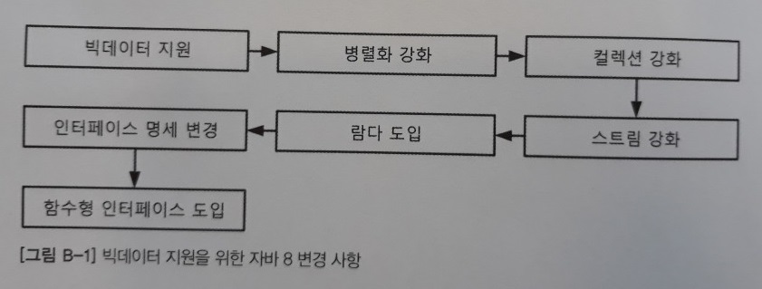
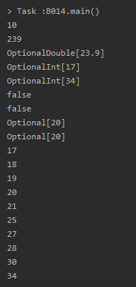

B. 자바 8 람다와 인터페이스 스펙 변화
=====
## 목차
1. [개요](#개요)
	* [람다 도입 이유](#람다-도입-이유)
	* [람다란](#람다란)
	* [함수형 인터페이스](#함수형-인터페이스)
2. [용례](#용례)
	* [메서드 호출 인자로 람다 사용](#메서드-호출-인자로-람다-사용)
	* [메서드 반환값으로 람다 사용](#메서드-반환값으로-람다-사용)
3. [자바 8](#자바-8)
	* [자바 8에서 제공하는 함수형 인터페이스](#자바-8에서-제공하는-함수형-인터페이스)
	* [컬렉션 스트림에서 람다 사용](#컬렉션-스트림에서-람다-사용)
	* 메서드 레퍼런스와 생성자 레퍼런스
4. [참고](#참고)

## 개요
자바 8은 언어적으로 많은 변화를 맞이했는데 특히 함수형 프로그래밍 지원을 위한 람다(Lambda)의 도입이 두드러진다. 이번 부록에서는 **람다의 개념**과 이를 지원하기 위해 변화된 **인터페이스 스펙** 부분을 살펴본다.

##### [목차로 이동](#목차)

### 람다 도입 이유
</br>

최근 빅데이터가 핫한데, 기업들은 빅데이터의 분석 및 활용을 통해 기업 전략을 수립하고 수익을 극대화하고자 한다. 그리고 그 방법의 중심에는 멀티 코어를 활용한 분산 처리, 즉 병렬화 기술이 필요하다.

기존에는 CPU 내부에 코어를 하나만 가지고 있었다. 이러한 CPU를 멀티태스킹 환경에서 사용하기 위해 시분할과 같은 기술이 사용되기는 했지만 일반 프로그래머들에게는 큰 영향을 주지 않았다. 하지만 이제 하나의 CPU 안에 다수의 코어를 삽입하는 멀티 코어 프로세서들이 등장하면서 일반 프로그래머에게도 병렬화 프로그래밍에 대한 필요성이 생기기 시작했다.

이러한 추세에 대응하기 위해 자바 8에서는 병렬화를 위해 컬렉션(배열, List, Set, Map)을 강화했고, 이러한 컬렉션을 효율적으로 사용하기 위해 스트림(Stream)을 강화했다. 또 스트림을 효율적으로 사용하기 위해 함수형 프로그래밍이, 다시 함수형 프로그래밍을 위해 람다가, 또 람다를 위해 인터페이스의 변화가 수반됐다(함수형 인터페이스). 이를 정리한 것이 바로 맨 위의 그램이다.

##### [목차로 이동](#목차)

### 람다란
기존의 코드 블록은 반드시 메서드 내에 존재해야 했다. 그래서 코드 블록만 갖고 싶어도 기존에는 코드 블록을 위해 메서드를, 다시 메서드를 사용하기 위해 익명 객체를 만들거나 하는 식이었다. 하지만 자바 8부터는 코드 블록을 만들기 위해 이러한 수고를 할 필요가 없다. 직접 코드를 통해 살펴본다.

* 람다 도입 이전
	* 별도 객체 생성  
		```java
		public class B001 {
			public static void main(String[] args) {
				MyTest mt = new MyTest();
				Runnable r = mt;
				r.run();
			}
		}

		class MyTest implements Runnable {
			@Override
			public void run() {
				System.out.println("Hello Lambda!!");
			}
		}
		```
	* 익명 객체 생성  
		```java
		public class B002 {
			public static void main(String[] args) {
				Runnable r = new Runnable() {
					@Override
					public void run() {
						System.out.println("Hello Lambda 2!!!");
					}
				};

				r.run();
			}
		}
		```
* 람다 도입 이후  
	```java
	public class B003 {
		public  static void main(String[] args) {
			Runnable r = () -> {
				System.out.println("Hello Lambda 3!!!");
			};

			r.run();
		}
	}
	```

익명 객체 사용 시에 비해 람다 도입 이후 어떤 부분이 변화했는지 살펴보면 크게 두 부분이다.

* `new Runnable()`: 사라짐
	* Runnable 타입으로 참조 변수 r을 만들고 있기 떄문에 new Runnable은 컴파일러가 알아낼 수 있음(∴ 코드 작성 불필요)
* `public void run()` → `()`: 변경됨
	* Runnable 인터페이스가 가진 추상 메서드가 run() 메서드 단 하나임


##### [목차로 이동](#목차)

### 함수형 인터페이스
앞에서 Runnable 인터페이스를 사용하는 코드를 람다식으로 변경했다. 이때 Runnable 인터페이스는 run()이라는 추상 메서드 하나만 가진다. 이처럼 추상 메서드를 하나만 갖는 인터페이스를 자바 8부터는 함수형 인터페이스라고 하고, 이런 함수형 인터페이스만을 람다식으로 변경할 수 있다.

```java
public class B005 {
    public static void main(String[] args) {
        MyFunctionalInterface mfi = (int a) -> {
            return a * a;
        };

        int b = mfi.runSomething(5);
        System.out.println(b);
    }
}

@FunctionalInterface
interface MyFunctionalInterface {
    public abstract int runSomething(int count);
}
```

이를 사용자 정의 인터페이스라고 한다. 이때 인터페이스인 MyFunctionalInterface 위에 @FunctionalInterface 어노테이션을 붙이는 것은 옵션(**협업시 권장**)이다. 이 어노테이션이 붙은 경우 컴파일러는 인터페이스가 함수형 인터페이스의 조건에 맞는지 검사한다. 즉, 단 하나의 추상 메서드만을 갖고 있는지 확인한다.

한편 위 코드를 아래와 같이 더 간소화할 수 있다.

```java
public class B006 {
    public static void main(String[] args) {
        MyFunctionalInterface mfi = a -> a * a;
        int b = mfi.runSomething(5);
        System.out.println(b);
    }
}
```

* `(int a)` → `a`
	* 람다식의 인자로 사용하고 있는 a가 int일 수밖에 없음을 runSomething 메서드 정의에서 알 수 있으므로 생략 가능(∵ 타입 추정 기능)
	* 인자가 하나이고 자료형 표기하지 않은 경우 소괄호 생략 가능
* `{return a * a; }` → `a * a`
	* 코드가 단 한 줄인 경우 중괄호(`{}`) 생략 가능
	* 이때 return 및 세미 콜론도 함께 생략(∵ runSomething 메서드 정의를 통해 int가 반환된다는 사실 알 수 있음)

##### [목차로 이동](#목차)

## 용례


##### [목차로 이동](#목차)

### 메서드 호출 인자로 람다 사용
```java
public class B007 {
    public static void main(String[] args) {
    MyFunctionalInterface mfi = a -> a * a;

    doIt(mfi);
    }

    public static void doIt(MyFunctionalInterface mfi) {
        int b = mfi.runSomething(5);

        System.out.println(b);
    }
}
```

람다식을 단 한번만 사용한다면 좀 더 간소화할 수 있다(∵ 변수 할당 불필요).

```java
public class B008 {
    public static void main(String[] args) {
        doIt(a -> a * a);   // 람다식 이용 코드에서 가장 많이 등장 형식
    }

    public static void doIt(MyFunctionalInterface mfi) {
        int b = mfi.runSomething(5);

        System.out.println(b);
    }
}
```

##### [목차로 이동](#목차)

### 메서드 반환값으로 람다 사용
```java
public class B009 {
    public static void main(String[] args) {
        MyFunctionalInterface mfi = todo();

        int result = mfi.runSomething(3);

        System.out.println(result);
    }

    public static MyFunctionalInterface todo() {
        return num -> num * num;
    }
}
```

##### [목차로 이동](#목차)

## 자바 8


##### [목차로 이동](#목차)

### 자바 8에서 제공하는 함수형 인터페이스
지금까지는 사용자 정의 함수형 인터페이스를 만들어 사용했다. 이제부터는 자바 8 API에서 제공되는 대표적인 함수형 인터페이스를 살펴본다. 이미 개발자들이 많이 쓸 것이라고 예상되는 함수형 인터페이스를 `java.util.function` 패키지와 여러 패키지에서 제공하고 있다.

| 함수형 인터페이스 | 추상 메서드 | 용도 |
| -- | -- | -- |
| Runable | void run() | 실행할 수 있는 인터페이스 |
| Supplier<T> | T get() | 제공할 수 있는 인터페이스 |
| Consumer<T> | void accept(T t) | 소비할 수 있는 인터페이스 |
| Function<T, R> | R apply(T t) | 입력을 받아서 출력할 수 있는 인터페이스 |
| Predicate<T> | Boolean test(T t) | 입력을 받아 참/거짓을 단정할 수 있는 인터페이스 |
| UnaryOperator<T> | T apply(T t) | 단항(Unary) 연산할 수 있는 인터페이스 |
| BiConsumer<T> | void accept(T t, U u) | 이항 소비자 인터페이스 |
| BiFunction<T, U, R> | R apply(T t, U u) | 이항 함수 인터페이스 |
| BiPredicate<T, U> | Boolean test(T t, U u) | 이항 단정 인터페이스 |
| BinaryOperator<T, T> | T apply(T t, T t) | 이항 연산 인터페이스 |

```java
import java.util.function.*;

public class B010 {
    public static void main(String[] args) {
        Runnable run = () -> System.out.println("hello");
        Supplier<Integer> sup = () -> 3 * 3;
        Consumer<Integer> con = num -> System.out.println(num);
        Function<Integer, String> fun = num -> "input: " + num;
        Predicate<Integer> pre = num -> num > 10;
        UnaryOperator<Integer> uOp = num -> num * num;

        BiConsumer<String, Integer> bCon = (str, num) -> System.out.println(str + num);
        BiFunction<Integer, Integer, String> bFun = (num1, num2) -> "add result: " + (num1 + num2);
        BiPredicate<Integer, Integer> bPre = (num1, num2) -> num1 > num2;
        BinaryOperator<Integer> b0p = (num1, num2) -> num1 - num2;
    }
}
```

이 외에도 `java.util.function` 패키지에서는 총 43개의 함수형 인터페이스를 제공한다.

##### [목차로 이동](#목차)

### 컬렉션 스트림에서 람다 사용
람다는 다양한 용도가 있지만 그 중에서도 컬렉션 스트림을 위한 기능에 크게 초점이 맞춰져 있다. 예제로 `미성년자 출입 제한 소스`를 살펴본다.

* for 구문 사용  
	```java
	public class B011 {
		public static void main(String[] args) {
			Integer[] ages = {20, 25, 18, 27, 30, 21, 17, 19, 34, 28};

			for (int i = 0; i < ages.length; i++) {
				if (ages[i] < 20) {
					System.out.format("Age %d!!! Can't enter\n", ages[i]);
				}
			}
		}
	}
	```
* forEach 구문 사용  
	```java
	public class B012 {
		public static void main(String[] args) {
			Integer[] ages = {20, 25, 18, 27, 30, 21, 17, 19, 34, 28};

			for (int age : ages) {
				if (age < 20) {
					System.out.format("Age %d!!! Can't enter\n", age);
				}
			}
		}
	}
	```
	* 인덱스 사용 안함
* 컬렉션 스트림 이용  
	```java
	import java.util.Arrays;

	public class B013 {
		public static void main(String[] args) {
			Integer[] ages = {20, 25, 18, 27, 30, 21, 17, 19, 34, 28};
			// 6번째 줄
			Arrays.stream(ages)
					.filter(age -> age < 20)
					.forEach(age -> System.out.format("Age %d!!! Can't enter\n", age));
		}
	}
	```
	* 7번째 줄
		* 기존 배열(`ages`)을 사용해 스트림을 얻기 위해 Arrays 클래스의 stream() 정적 메서드 사용
	* 8번째 줄: 20세 미만인 경우를 선별(filter)해주세요
		* filter 메서드는 SQL 구문의 where 절과 같은 역할 수행(∵ true/false 반환하는 조건 필요)
		* 함수형 인터페이스 중 true/false를 반환하는 Predicate 함수형 인터페이스를 filter 메서드의 인자로 제공
	* 9번째 줄: 선별된 각 요소에 대해 입장이 불가하다고 해주세요
		* 스트림 내부 반복을 실행하는 forEach 메서드 사용
		* forEach 구문은 전달된 인자를 소비하는 함수형 인터페이스, 즉 Consumer를 요구

이처럼 스트림은 선언적으로 코딩할 수 있기 때문에 가독성을 취할 수 있다. 또한 메서드 체인 패턴을 이용해 최종 연산이 아닌 모든 중간 연산은 다시 스트림을 반환해 코드를 간략하게 작성할 수 있게 지원한다. 아래에 몇 개의 최종 연산을 활용하는 예제 코드를 추가한다.

```java
import java.util.Arrays;

public class B014 {
    public static void main(String[] args) {
        Integer[] ages = {20, 25, 18, 27, 30, 21, 17, 19, 34, 28};

        System.out.println(Arrays.stream(ages).count());

        System.out.println(Arrays.stream(ages).mapToInt(age -> age).sum());
        System.out.println(Arrays.stream(ages).mapToInt(age -> age).average());
        System.out.println(Arrays.stream(ages).mapToInt(age -> age).min());
        System.out.println(Arrays.stream(ages).mapToInt(age -> age).max());

        System.out.println(Arrays.stream(ages).allMatch(age -> age > 20));
        System.out.println(Arrays.stream(ages).allMatch(age -> age > 30));

        System.out.println(Arrays.stream(ages).findFirst());
        System.out.println(Arrays.stream(ages).findAny());

        Arrays.stream(ages).sorted().forEach(System.out::println);
    }
}
```

실행결과는 다음과 같다.

</br>

##### [목차로 이동](#목차)

### 메서드 레퍼런스와 생성자 레퍼런스
추후.

```java
import java.util.Arrays;
import java.util.function.BiFunction;

public class B015 {
    public static void main(String[] args) {
        Double[] nums = {1.0, 4.0, 9.0, 16.0, 25.0};

        System.out.println("==== Lambda ====");
        Arrays.stream(nums)
                .map(num -> Math.sqrt(num))
                .forEach(sqrtNum -> System.out.println(sqrtNum));

        System.out.println("==== Method Reference ====");
        Arrays.stream(nums)
                .map(Math::sqrt)
                .forEach(System.out::println);

        BiFunction<Integer, Integer, Integer> bip_lambda = (a, b) -> a.compareTo(b);
        BiFunction<Integer, Integer, Integer> bip_reference = Integer::compareTo;

        System.out.println(bip_lambda.apply(10, 12));
        System.out.println(bip_lambda.apply(10, 10));
        System.out.println(bip_lambda.apply(10, 2));

        System.out.println(bip_reference.apply(10, 12));
        System.out.println(bip_reference.apply(10, 10));
        System.out.println(bip_reference.apply(10, 2));
    }
}
```

##### [목차로 이동](#목차)

## 참고
* JAVA8 변경사항 - LichKing님
	* [#1_람다 표현식](https://multifrontgarden.tistory.com/124?category=471239)
	* [#2_함수형 인터페이스](https://multifrontgarden.tistory.com/125)
	* [#3_메서드 레퍼런스](https://multifrontgarden.tistory.com/126?category=471239)
	* [#4_스트림](https://multifrontgarden.tistory.com/128)
	* [#5_Optional](https://multifrontgarden.tistory.com/131?category=471239)
* [JAVA8 - 함수형 프로그래밍](https://swiftymind.tistory.com/108)
* [JAVA8 - 스트림](https://effectivesquid.tistory.com/entry/Java-Stream%EC%9D%B4%EB%9E%80)

##### [목차로 이동](#목차)
